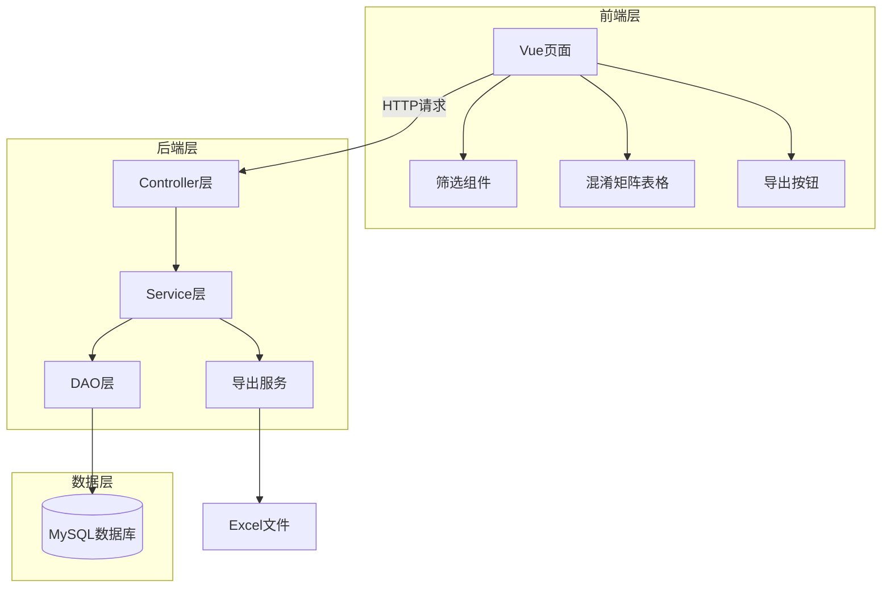
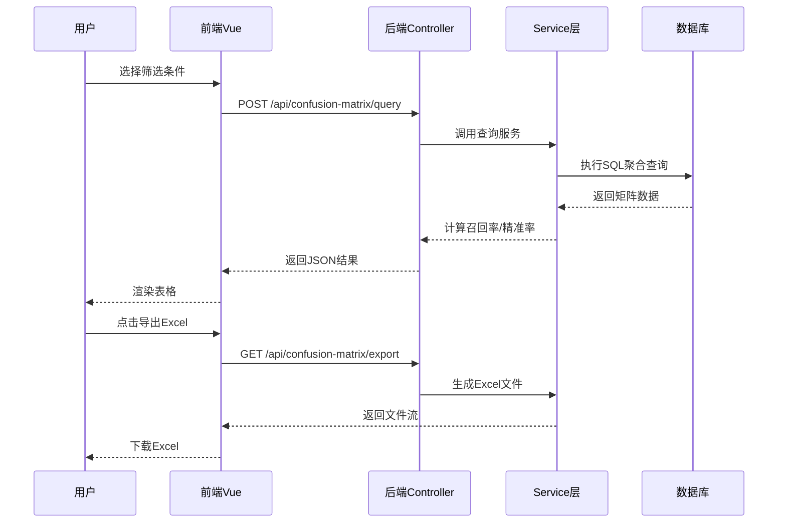

# 分类预测结果统计报表系统 - 需求分析与系统概述

## 一、业务背景

您需要一个**分类预测结果统计分析系统**,用于评估机器学习或业务分类模型的预测效果。

### 核心概念解释

#### 1. 什么是混淆矩阵 (Confusion Matrix)
混淆矩阵是评估分类模型性能的重要工具,它展示了:
- **行**: 实际的真实分类 (Actual/True Label)
- **列**: 模型预测的分类 (Predicted Label)
- **单元格数值**: 该组合出现的次数

**示例**: 如果实际分类是"类别5",模型预测为"类别3",则在矩阵的(实际5, 预测3)位置计数+1

#### 2. 关键指标
- **召回率 (Recall)**: 对于某个实际类别,模型正确识别的比例
  - 公式: 召回率 = 正确预测数 / 该类别总数
  - 示例: 实际有100个"类别5",模型正确预测了80个,召回率=80%

- **精准率 (Precision)**: 对于某个预测类别,预测正确的比例
  - 公式: 精准率 = 正确预测数 / 预测为该类别的总数
  - 示例: 模型预测了120个"类别5",其中80个是对的,精准率=66.7%

---

## 二、功能需求

### 2.1 核心数据结构
每条数据记录包含:
```
{
  "一级分类": "服装",
  "二级分类": "上衣",
  "预期值": 5,      // 真实标签
  "实际值": 3,      // 模型预测值
  "是否一致": "fail", // pass/fail

  // 可选筛选维度
  "用例": "春季新品测试",
  "场景": "电商推荐",
  "垂类": "女装",
  "因子": "颜色",
  "因子值": "红色"
}
```

### 2.2 筛选功能
用户可以通过以下条件组合筛选数据:
- 用例 (Test Case)
- 场景 (Scenario)
- 垂类 (Vertical Category)
- 因子 (Factor)
- 因子值 (Factor Value)

### 2.3 报表展示
生成混淆矩阵表格,格式如下:

```
一级分类: 服装 > 二级分类: 上衣

              预测为0  预测为1  ...  预测为15  SUM   召回率
实际为0         45      3           1       50    90%
实际为1         2       38          0       40    95%
...
实际为15        0       1           25      28    89%
SUM            52      45          28      500
精准率         86%     84%         89%            总准确率92%
```

---

## 三、系统架构

### 3.1 技术栈
- **前端**: Vue.js 3 + Element Plus (表格组件)
- **后端**: Spring Boot (Java)
- **数据库**: MySQL 8.0
- **导出**: Apache POI (Excel导出)

### 3.2 系统分层架构



### 3.3 数据流转



---

## 四、报表样式说明

### 4.1 表格结构
这是一个**双向汇总表格**:
- **横向**: 预测值的分布 (列)
- **纵向**: 实际值的分布 (行)
- **最右列**: 每行的SUM和召回率
- **最底行**: 每列的SUM和精准率

### 4.2 颜色编码建议
- **对角线** (预测=实际): 绿色背景 ✅ (预测正确)
- **非对角线**: 红色背景 ❌ (预测错误)
- **召回率/精准率**:
  - ≥90%: 深绿色
  - 70%-90%: 黄色
  - <70%: 红色

### 4.3 交互功能
- 点击单元格数字 → 弹窗显示详细数据列表
- 支持按一级/二级分类切换
- 支持导出当前筛选结果为Excel

---

## 五、下一步设计内容

1. **数据库表结构设计** (02-数据库设计.md)
2. **后端Java接口设计** (03-后端设计.md)
3. **前端Vue组件设计** (04-前端设计.md)
4. **HTML原型演示** (05-HTML原型.html)

---

## 六、关键技术难点

### 6.1 SQL性能优化
- 需要对大量数据进行分组聚合
- 建议使用**物化视图**或**预聚合表**

### 6.2 前端大表格渲染
- 16x16的矩阵 + 统计列 = 约300个单元格
- 使用虚拟滚动优化性能

### 6.3 Excel导出格式
- 需要合并单元格
- 需要条件格式化(颜色编码)

---

**备注**: 这是一个典型的**BI报表系统**,核心是混淆矩阵的生成和可视化。
