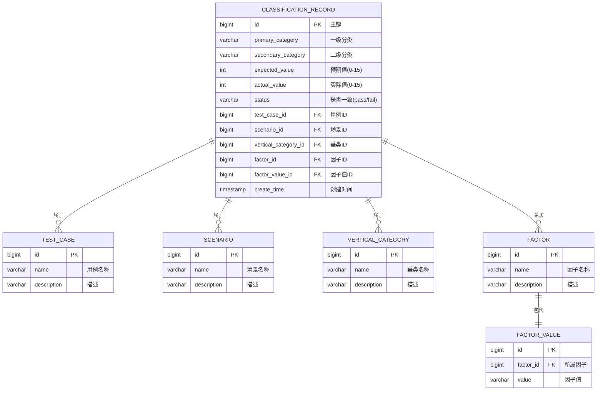

# 数据库表结构设计

## 一、ER关系图



---

## 二、核心表结构 SQL

### 2.1 分类记录主表

```sql
CREATE TABLE `classification_record` (
  `id` BIGINT NOT NULL AUTO_INCREMENT COMMENT '主键ID',
  `primary_category` VARCHAR(100) NOT NULL COMMENT '一级分类',
  `secondary_category` VARCHAR(100) NOT NULL COMMENT '二级分类',
  `expected_value` TINYINT NOT NULL COMMENT '预期值(真实标签,0-15)',
  `actual_value` TINYINT NOT NULL COMMENT '实际值(预测值,0-15)',
  `status` VARCHAR(10) NOT NULL COMMENT '是否一致(pass/fail)',

  -- 关联维度
  `test_case_id` BIGINT DEFAULT NULL COMMENT '用例ID',
  `scenario_id` BIGINT DEFAULT NULL COMMENT '场景ID',
  `vertical_category_id` BIGINT DEFAULT NULL COMMENT '垂类ID',
  `factor_id` BIGINT DEFAULT NULL COMMENT '因子ID',
  `factor_value_id` BIGINT DEFAULT NULL COMMENT '因子值ID',

  -- 扩展字段
  `remark` VARCHAR(500) DEFAULT NULL COMMENT '备注',
  `create_time` TIMESTAMP NOT NULL DEFAULT CURRENT_TIMESTAMP COMMENT '创建时间',
  `update_time` TIMESTAMP NOT NULL DEFAULT CURRENT_TIMESTAMP ON UPDATE CURRENT_TIMESTAMP,

  PRIMARY KEY (`id`),
  INDEX `idx_primary_category` (`primary_category`),
  INDEX `idx_secondary_category` (`secondary_category`),
  INDEX `idx_expected_actual` (`expected_value`, `actual_value`),
  INDEX `idx_test_case` (`test_case_id`),
  INDEX `idx_scenario` (`scenario_id`),
  INDEX `idx_vertical_category` (`vertical_category_id`),
  INDEX `idx_factor` (`factor_id`, `factor_value_id`),
  INDEX `idx_create_time` (`create_time`)
) ENGINE=InnoDB DEFAULT CHARSET=utf8mb4 COMMENT='分类预测记录表';
```

### 2.2 用例表

```sql
CREATE TABLE `test_case` (
  `id` BIGINT NOT NULL AUTO_INCREMENT,
  `name` VARCHAR(200) NOT NULL COMMENT '用例名称',
  `code` VARCHAR(50) NOT NULL UNIQUE COMMENT '用例编码',
  `description` VARCHAR(500) DEFAULT NULL,
  `status` VARCHAR(20) DEFAULT 'active' COMMENT 'active/inactive',
  `create_time` TIMESTAMP NOT NULL DEFAULT CURRENT_TIMESTAMP,
  `update_time` TIMESTAMP NOT NULL DEFAULT CURRENT_TIMESTAMP ON UPDATE CURRENT_TIMESTAMP,
  PRIMARY KEY (`id`),
  UNIQUE KEY `uk_code` (`code`)
) ENGINE=InnoDB DEFAULT CHARSET=utf8mb4 COMMENT='测试用例表';
```

### 2.3 场景表

```sql
CREATE TABLE `scenario` (
  `id` BIGINT NOT NULL AUTO_INCREMENT,
  `name` VARCHAR(200) NOT NULL COMMENT '场景名称',
  `code` VARCHAR(50) NOT NULL UNIQUE COMMENT '场景编码',
  `description` VARCHAR(500) DEFAULT NULL,
  `create_time` TIMESTAMP NOT NULL DEFAULT CURRENT_TIMESTAMP,
  `update_time` TIMESTAMP NOT NULL DEFAULT CURRENT_TIMESTAMP ON UPDATE CURRENT_TIMESTAMP,
  PRIMARY KEY (`id`),
  UNIQUE KEY `uk_code` (`code`)
) ENGINE=InnoDB DEFAULT CHARSET=utf8mb4 COMMENT='应用场景表';
```

### 2.4 垂类表

```sql
CREATE TABLE `vertical_category` (
  `id` BIGINT NOT NULL AUTO_INCREMENT,
  `name` VARCHAR(200) NOT NULL COMMENT '垂类名称',
  `code` VARCHAR(50) NOT NULL UNIQUE COMMENT '垂类编码',
  `parent_id` BIGINT DEFAULT NULL COMMENT '父垂类ID(支持层级)',
  `description` VARCHAR(500) DEFAULT NULL,
  `create_time` TIMESTAMP NOT NULL DEFAULT CURRENT_TIMESTAMP,
  `update_time` TIMESTAMP NOT NULL DEFAULT CURRENT_TIMESTAMP ON UPDATE CURRENT_TIMESTAMP,
  PRIMARY KEY (`id`),
  UNIQUE KEY `uk_code` (`code`),
  INDEX `idx_parent` (`parent_id`)
) ENGINE=InnoDB DEFAULT CHARSET=utf8mb4 COMMENT='垂直类目表';
```

### 2.5 因子表

```sql
CREATE TABLE `factor` (
  `id` BIGINT NOT NULL AUTO_INCREMENT,
  `name` VARCHAR(200) NOT NULL COMMENT '因子名称',
  `code` VARCHAR(50) NOT NULL UNIQUE COMMENT '因子编码',
  `type` VARCHAR(50) DEFAULT NULL COMMENT '因子类型(string/number/enum)',
  `description` VARCHAR(500) DEFAULT NULL,
  `create_time` TIMESTAMP NOT NULL DEFAULT CURRENT_TIMESTAMP,
  `update_time` TIMESTAMP NOT NULL DEFAULT CURRENT_TIMESTAMP ON UPDATE CURRENT_TIMESTAMP,
  PRIMARY KEY (`id`),
  UNIQUE KEY `uk_code` (`code`)
) ENGINE=InnoDB DEFAULT CHARSET=utf8mb4 COMMENT='因子表';
```

### 2.6 因子值表

```sql
CREATE TABLE `factor_value` (
  `id` BIGINT NOT NULL AUTO_INCREMENT,
  `factor_id` BIGINT NOT NULL COMMENT '所属因子ID',
  `value` VARCHAR(200) NOT NULL COMMENT '因子值',
  `display_name` VARCHAR(200) DEFAULT NULL COMMENT '显示名称',
  `sort_order` INT DEFAULT 0 COMMENT '排序',
  `create_time` TIMESTAMP NOT NULL DEFAULT CURRENT_TIMESTAMP,
  `update_time` TIMESTAMP NOT NULL DEFAULT CURRENT_TIMESTAMP ON UPDATE CURRENT_TIMESTAMP,
  PRIMARY KEY (`id`),
  INDEX `idx_factor_id` (`factor_id`),
  UNIQUE KEY `uk_factor_value` (`factor_id`, `value`),
  CONSTRAINT `fk_factor_value_factor` FOREIGN KEY (`factor_id`) REFERENCES `factor`(`id`)
) ENGINE=InnoDB DEFAULT CHARSET=utf8mb4 COMMENT='因子值表';
```

---

## 三、关键SQL查询逻辑

### 3.1 混淆矩阵查询 (核心SQL)

```sql
-- 查询混淆矩阵数据
SELECT
    expected_value AS actual_label,
    actual_value AS predicted_label,
    COUNT(*) AS count
FROM
    classification_record
WHERE
    1=1
    -- 动态筛选条件
    AND (test_case_id = ? OR ? IS NULL)
    AND (scenario_id = ? OR ? IS NULL)
    AND (vertical_category_id = ? OR ? IS NULL)
    AND (factor_id = ? OR ? IS NULL)
    AND (factor_value_id = ? OR ? IS NULL)
    AND (primary_category = ? OR ? IS NULL)
    AND (secondary_category = ? OR ? IS NULL)
GROUP BY
    expected_value, actual_value
ORDER BY
    expected_value, actual_value;
```

**查询结果示例**:
```
actual_label | predicted_label | count
-------------|-----------------|------
0            | 0               | 45
0            | 1               | 3
0            | 15              | 2
1            | 0               | 2
1            | 1               | 38
...
```

### 3.2 召回率计算SQL

```sql
-- 计算每个实际标签的召回率
SELECT
    expected_value AS actual_label,
    SUM(CASE WHEN expected_value = actual_value THEN 1 ELSE 0 END) AS correct_count,
    COUNT(*) AS total_count,
    ROUND(SUM(CASE WHEN expected_value = actual_value THEN 1 ELSE 0 END) * 100.0 / COUNT(*), 2) AS recall_rate
FROM
    classification_record
WHERE
    -- 同样的筛选条件
    1=1
GROUP BY
    expected_value
ORDER BY
    expected_value;
```

**查询结果示例**:
```
actual_label | correct_count | total_count | recall_rate
-------------|---------------|-------------|------------
0            | 45            | 50          | 90.00
1            | 38            | 40          | 95.00
...
```

### 3.3 精准率计算SQL

```sql
-- 计算每个预测标签的精准率
SELECT
    actual_value AS predicted_label,
    SUM(CASE WHEN expected_value = actual_value THEN 1 ELSE 0 END) AS correct_count,
    COUNT(*) AS total_count,
    ROUND(SUM(CASE WHEN expected_value = actual_value THEN 1 ELSE 0 END) * 100.0 / COUNT(*), 2) AS precision_rate
FROM
    classification_record
WHERE
    -- 同样的筛选条件
    1=1
GROUP BY
    actual_value
ORDER BY
    actual_value;
```

### 3.4 综合统计查询 (一次性获取所有数据)

```sql
-- 使用子查询和UNION组合
WITH matrix_data AS (
    SELECT
        expected_value,
        actual_value,
        COUNT(*) AS count
    FROM classification_record
    WHERE 1=1 -- 筛选条件
    GROUP BY expected_value, actual_value
),
row_totals AS (
    SELECT
        expected_value,
        SUM(count) AS row_sum,
        SUM(CASE WHEN expected_value = actual_value THEN count ELSE 0 END) AS row_correct
    FROM matrix_data
    GROUP BY expected_value
),
col_totals AS (
    SELECT
        actual_value,
        SUM(count) AS col_sum,
        SUM(CASE WHEN expected_value = actual_value THEN count ELSE 0 END) AS col_correct
    FROM matrix_data
    GROUP BY actual_value
)
SELECT
    m.*,
    r.row_sum,
    r.row_correct,
    ROUND(r.row_correct * 100.0 / r.row_sum, 2) AS recall_rate,
    c.col_sum,
    c.col_correct,
    ROUND(c.col_correct * 100.0 / c.col_sum, 2) AS precision_rate
FROM matrix_data m
LEFT JOIN row_totals r ON m.expected_value = r.expected_value
LEFT JOIN col_totals c ON m.actual_value = c.actual_value;
```

---

## 四、索引优化策略

### 4.1 关键索引说明

| 索引名称 | 字段 | 作用 |
|---------|------|------|
| idx_primary_category | primary_category | 加速一级分类筛选 |
| idx_expected_actual | expected_value, actual_value | 加速矩阵统计 |
| idx_test_case | test_case_id | 加速用例筛选 |
| idx_scenario | scenario_id | 加速场景筛选 |
| idx_vertical_category | vertical_category_id | 加速垂类筛选 |
| idx_factor | factor_id, factor_value_id | 加速因子筛选 |

### 4.2 组合索引建议

如果经常同时按多个维度筛选,可以创建组合索引:

```sql
-- 示例: 经常按一级分类+用例+场景筛选
CREATE INDEX idx_category_case_scenario
ON classification_record(primary_category, test_case_id, scenario_id);
```

---

## 五、数据分区策略 (可选,大数据量场景)

如果数据量超过千万级,建议按时间分区:

```sql
CREATE TABLE `classification_record` (
  -- 字段同上
  ...
  `create_time` TIMESTAMP NOT NULL
)
PARTITION BY RANGE (UNIX_TIMESTAMP(create_time)) (
  PARTITION p202401 VALUES LESS THAN (UNIX_TIMESTAMP('2024-02-01')),
  PARTITION p202402 VALUES LESS THAN (UNIX_TIMESTAMP('2024-03-01')),
  PARTITION p202403 VALUES LESS THAN (UNIX_TIMESTAMP('2024-04-01')),
  PARTITION p_future VALUES LESS THAN MAXVALUE
);
```

---

## 六、测试数据生成脚本

```sql
-- 插入测试用例
INSERT INTO test_case (name, code, description) VALUES
('春季新品测试', 'TC001', '测试春季新品分类准确性'),
('促销活动测试', 'TC002', '测试促销商品分类');

-- 插入场景
INSERT INTO scenario (name, code, description) VALUES
('电商推荐', 'SC001', '电商平台商品推荐场景'),
('搜索结果', 'SC002', '搜索结果分类场景');

-- 插入垂类
INSERT INTO vertical_category (name, code, description) VALUES
('女装', 'VC001', '女性服装类目'),
('男装', 'VC002', '男性服装类目');

-- 插入因子
INSERT INTO factor (name, code, type) VALUES
('颜色', 'FACTOR_COLOR', 'enum'),
('尺码', 'FACTOR_SIZE', 'enum');

-- 插入因子值
INSERT INTO factor_value (factor_id, value, display_name) VALUES
(1, 'red', '红色'),
(1, 'blue', '蓝色'),
(2, 'S', '小号'),
(2, 'M', '中号');

-- 插入测试记录 (生成1000条随机数据)
INSERT INTO classification_record
(primary_category, secondary_category, expected_value, actual_value, status, test_case_id, scenario_id)
SELECT
    '服装' AS primary_category,
    '上衣' AS secondary_category,
    FLOOR(RAND() * 16) AS expected_value,
    FLOOR(RAND() * 16) AS actual_value,
    CASE WHEN FLOOR(RAND() * 16) = FLOOR(RAND() * 16) THEN 'pass' ELSE 'fail' END AS status,
    FLOOR(RAND() * 2) + 1 AS test_case_id,
    FLOOR(RAND() * 2) + 1 AS scenario_id
FROM
    (SELECT 1 UNION SELECT 2 UNION SELECT 3 UNION SELECT 4 UNION SELECT 5) t1,
    (SELECT 1 UNION SELECT 2 UNION SELECT 3 UNION SELECT 4 UNION SELECT 5) t2,
    (SELECT 1 UNION SELECT 2 UNION SELECT 3 UNION SELECT 4 UNION SELECT 5) t3,
    (SELECT 1 UNION SELECT 2 UNION SELECT 3 UNION SELECT 4 UNION SELECT 5) t4
LIMIT 1000;
```

---

## 七、数据库性能优化建议

1. **读写分离**: 主库写入,从库查询
2. **缓存层**: 使用Redis缓存热门查询结果 (如最近1小时的统计)
3. **预聚合表**: 定时任务生成每小时/每天的混淆矩阵快照
4. **分库分表**: 按一级分类或时间维度分表

```sql
-- 预聚合表示例
CREATE TABLE `confusion_matrix_snapshot` (
  `id` BIGINT NOT NULL AUTO_INCREMENT,
  `snapshot_time` TIMESTAMP NOT NULL COMMENT '快照时间',
  `primary_category` VARCHAR(100) NOT NULL,
  `expected_value` TINYINT NOT NULL,
  `actual_value` TINYINT NOT NULL,
  `count` INT NOT NULL,
  `test_case_id` BIGINT,
  `scenario_id` BIGINT,
  PRIMARY KEY (`id`),
  INDEX `idx_snapshot` (`snapshot_time`, `primary_category`)
) ENGINE=InnoDB DEFAULT CHARSET=utf8mb4 COMMENT='混淆矩阵快照表';
```

---

**下一步**: 查看 [03-后端设计.md](03-后端设计.md)
