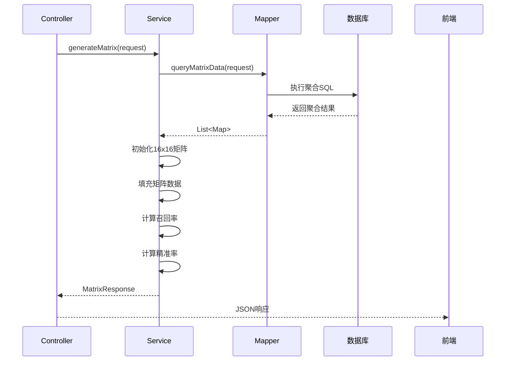

# 后端 Spring Boot 设计

## 一、项目结构

```
backend/
├── src/main/java/com/example/confusion/
│   ├── ConfusionMatrixApplication.java          # 启动类
│   ├── controller/
│   │   └── ConfusionMatrixController.java       # 控制器
│   ├── service/
│   │   ├── ConfusionMatrixService.java          # 业务接口
│   │   └── impl/
│   │       └── ConfusionMatrixServiceImpl.java  # 业务实现
│   ├── dao/
│   │   └── ClassificationRecordMapper.java      # MyBatis Mapper
│   ├── entity/
│   │   ├── ClassificationRecord.java            # 实体类
│   │   ├── TestCase.java
│   │   └── ...
│   ├── dto/
│   │   ├── QueryRequest.java                    # 请求DTO
│   │   ├── MatrixResponse.java                  # 响应DTO
│   │   └── MatrixCell.java                      # 矩阵单元格
│   └── util/
│       └── ExcelExportUtil.java                 # Excel导出工具
├── src/main/resources/
│   ├── application.yml                          # 配置文件
│   └── mapper/
│       └── ClassificationRecordMapper.xml       # MyBatis XML
└── pom.xml                                      # Maven依赖
```

---

## 二、核心类设计

### 2.1 实体类 (Entity)

#### ClassificationRecord.java

```java
package com.example.confusion.entity;

import lombok.Data;
import java.time.LocalDateTime;

@Data
public class ClassificationRecord {
    private Long id;
    private String primaryCategory;      // 一级分类
    private String secondaryCategory;    // 二级分类
    private Integer expectedValue;       // 预期值(0-15)
    private Integer actualValue;         // 实际值(0-15)
    private String status;               // pass/fail

    // 关联维度
    private Long testCaseId;
    private Long scenarioId;
    private Long verticalCategoryId;
    private Long factorId;
    private Long factorValueId;

    // 扩展字段
    private String remark;
    private LocalDateTime createTime;
    private LocalDateTime updateTime;
}
```

---

### 2.2 请求/响应 DTO

#### QueryRequest.java (筛选条件)

```java
package com.example.confusion.dto;

import lombok.Data;

@Data
public class QueryRequest {
    // 分类筛选
    private String primaryCategory;
    private String secondaryCategory;

    // 可选维度筛选
    private Long testCaseId;
    private Long scenarioId;
    private Long verticalCategoryId;
    private Long factorId;
    private Long factorValueId;

    // 时间范围筛选 (可选)
    private String startTime;
    private String endTime;
}
```

#### MatrixResponse.java (完整矩阵数据)

```java
package com.example.confusion.dto;

import lombok.Data;
import java.util.List;
import java.util.Map;

@Data
public class MatrixResponse {
    private String primaryCategory;      // 一级分类
    private String secondaryCategory;    // 二级分类

    // 矩阵数据: [实际值][预测值] = 数量
    // 例如: matrix[5][3] = 10 表示"实际为5,预测为3"有10条记录
    private Integer[][] matrix;          // 16x16 矩阵

    // 每行统计
    private List<RowSummary> rowSummaries;  // 按实际值统计

    // 每列统计
    private List<ColumnSummary> columnSummaries; // 按预测值统计

    // 总体指标
    private Integer totalCount;           // 总记录数
    private Integer correctCount;         // 预测正确数
    private Double accuracy;              // 总准确率

    @Data
    public static class RowSummary {
        private Integer actualLabel;      // 实际标签(0-15)
        private Integer total;            // 该标签总数
        private Integer correct;          // 预测正确数
        private Double recallRate;        // 召回率
    }

    @Data
    public static class ColumnSummary {
        private Integer predictedLabel;   // 预测标签(0-15)
        private Integer total;            // 预测为该标签的总数
        private Integer correct;          // 预测正确数
        private Double precisionRate;     // 精准率
    }
}
```

#### MatrixCell.java (单个单元格详情)

```java
package com.example.confusion.dto;

import lombok.Data;
import java.util.List;

@Data
public class MatrixCellDetail {
    private Integer expectedValue;
    private Integer actualValue;
    private Integer count;
    private List<ClassificationRecord> records; // 详细记录列表
}
```

---

### 2.3 Controller层

#### ConfusionMatrixController.java

```java
package com.example.confusion.controller;

import com.example.confusion.dto.*;
import com.example.confusion.service.ConfusionMatrixService;
import org.springframework.beans.factory.annotation.Autowired;
import org.springframework.http.HttpHeaders;
import org.springframework.http.MediaType;
import org.springframework.http.ResponseEntity;
import org.springframework.web.bind.annotation.*;

import javax.servlet.http.HttpServletResponse;
import java.io.IOException;

@RestController
@RequestMapping("/api/confusion-matrix")
@CrossOrigin(origins = "*")  // 开发环境允许跨域
public class ConfusionMatrixController {

    @Autowired
    private ConfusionMatrixService confusionMatrixService;

    /**
     * 查询混淆矩阵数据
     * @param request 筛选条件
     * @return 混淆矩阵结果
     */
    @PostMapping("/query")
    public ResponseEntity<MatrixResponse> queryMatrix(@RequestBody QueryRequest request) {
        MatrixResponse response = confusionMatrixService.generateMatrix(request);
        return ResponseEntity.ok(response);
    }

    /**
     * 获取单元格详细数据
     * @param request 筛选条件
     * @param expectedValue 预期值
     * @param actualValue 实际值
     * @return 该单元格的详细记录
     */
    @PostMapping("/cell-detail")
    public ResponseEntity<MatrixCellDetail> getCellDetail(
            @RequestBody QueryRequest request,
            @RequestParam Integer expectedValue,
            @RequestParam Integer actualValue) {

        MatrixCellDetail detail = confusionMatrixService.getCellDetail(
                request, expectedValue, actualValue);
        return ResponseEntity.ok(detail);
    }

    /**
     * 导出Excel
     * @param request 筛选条件
     * @param response HTTP响应
     */
    @PostMapping("/export")
    public void exportExcel(
            @RequestBody QueryRequest request,
            HttpServletResponse response) throws IOException {

        // 生成矩阵数据
        MatrixResponse matrixData = confusionMatrixService.generateMatrix(request);

        // 设置响应头
        response.setContentType("application/vnd.openxmlformats-officedocument.spreadsheetml.sheet");
        response.setHeader(HttpHeaders.CONTENT_DISPOSITION,
                "attachment; filename=confusion_matrix.xlsx");

        // 导出Excel
        confusionMatrixService.exportToExcel(matrixData, response.getOutputStream());
    }

    /**
     * 获取所有筛选选项 (用于前端下拉框)
     */
    @GetMapping("/filter-options")
    public ResponseEntity<FilterOptions> getFilterOptions() {
        FilterOptions options = confusionMatrixService.getFilterOptions();
        return ResponseEntity.ok(options);
    }
}
```

---

### 2.4 Service层

#### ConfusionMatrixService.java (接口)

```java
package com.example.confusion.service;

import com.example.confusion.dto.*;
import java.io.OutputStream;
import java.io.IOException;

public interface ConfusionMatrixService {

    /**
     * 生成混淆矩阵
     */
    MatrixResponse generateMatrix(QueryRequest request);

    /**
     * 获取单元格详细数据
     */
    MatrixCellDetail getCellDetail(QueryRequest request, Integer expectedValue, Integer actualValue);

    /**
     * 导出Excel
     */
    void exportToExcel(MatrixResponse matrixData, OutputStream outputStream) throws IOException;

    /**
     * 获取筛选选项
     */
    FilterOptions getFilterOptions();
}
```

#### ConfusionMatrixServiceImpl.java (实现)

```java
package com.example.confusion.service.impl;

import com.example.confusion.dao.ClassificationRecordMapper;
import com.example.confusion.dto.*;
import com.example.confusion.entity.ClassificationRecord;
import com.example.confusion.service.ConfusionMatrixService;
import com.example.confusion.util.ExcelExportUtil;
import org.springframework.beans.factory.annotation.Autowired;
import org.springframework.stereotype.Service;

import java.io.IOException;
import java.io.OutputStream;
import java.util.*;
import java.util.stream.Collectors;

@Service
public class ConfusionMatrixServiceImpl implements ConfusionMatrixService {

    @Autowired
    private ClassificationRecordMapper recordMapper;

    @Override
    public MatrixResponse generateMatrix(QueryRequest request) {
        MatrixResponse response = new MatrixResponse();
        response.setPrimaryCategory(request.getPrimaryCategory());
        response.setSecondaryCategory(request.getSecondaryCategory());

        // 1. 查询原始数据
        List<Map<String, Object>> rawData = recordMapper.queryMatrixData(request);

        // 2. 初始化 16x16 矩阵
        Integer[][] matrix = new Integer[16][16];
        for (int i = 0; i < 16; i++) {
            for (int j = 0; j < 16; j++) {
                matrix[i][j] = 0;
            }
        }

        // 3. 填充矩阵数据
        int totalCount = 0;
        int correctCount = 0;
        for (Map<String, Object> row : rawData) {
            int expected = (Integer) row.get("expected_value");
            int actual = (Integer) row.get("actual_value");
            int count = ((Number) row.get("count")).intValue();

            matrix[expected][actual] = count;
            totalCount += count;
            if (expected == actual) {
                correctCount += count;
            }
        }
        response.setMatrix(matrix);
        response.setTotalCount(totalCount);
        response.setCorrectCount(correctCount);
        response.setAccuracy(totalCount > 0 ? (double) correctCount / totalCount : 0.0);

        // 4. 计算行统计 (召回率)
        List<MatrixResponse.RowSummary> rowSummaries = new ArrayList<>();
        for (int i = 0; i < 16; i++) {
            MatrixResponse.RowSummary summary = new MatrixResponse.RowSummary();
            summary.setActualLabel(i);

            int rowTotal = 0;
            int rowCorrect = matrix[i][i];
            for (int j = 0; j < 16; j++) {
                rowTotal += matrix[i][j];
            }

            summary.setTotal(rowTotal);
            summary.setCorrect(rowCorrect);
            summary.setRecallRate(rowTotal > 0 ? (double) rowCorrect / rowTotal : 0.0);
            rowSummaries.add(summary);
        }
        response.setRowSummaries(rowSummaries);

        // 5. 计算列统计 (精准率)
        List<MatrixResponse.ColumnSummary> columnSummaries = new ArrayList<>();
        for (int j = 0; j < 16; j++) {
            MatrixResponse.ColumnSummary summary = new MatrixResponse.ColumnSummary();
            summary.setPredictedLabel(j);

            int colTotal = 0;
            int colCorrect = matrix[j][j];
            for (int i = 0; i < 16; i++) {
                colTotal += matrix[i][j];
            }

            summary.setTotal(colTotal);
            summary.setCorrect(colCorrect);
            summary.setPrecisionRate(colTotal > 0 ? (double) colCorrect / colTotal : 0.0);
            columnSummaries.add(summary);
        }
        response.setColumnSummaries(columnSummaries);

        return response;
    }

    @Override
    public MatrixCellDetail getCellDetail(QueryRequest request, Integer expectedValue, Integer actualValue) {
        MatrixCellDetail detail = new MatrixCellDetail();
        detail.setExpectedValue(expectedValue);
        detail.setActualValue(actualValue);

        // 查询该单元格的详细记录
        List<ClassificationRecord> records = recordMapper.queryCellRecords(
                request, expectedValue, actualValue);

        detail.setCount(records.size());
        detail.setRecords(records);

        return detail;
    }

    @Override
    public void exportToExcel(MatrixResponse matrixData, OutputStream outputStream) throws IOException {
        ExcelExportUtil.export(matrixData, outputStream);
    }

    @Override
    public FilterOptions getFilterOptions() {
        FilterOptions options = new FilterOptions();
        options.setTestCases(recordMapper.getAllTestCases());
        options.setScenarios(recordMapper.getAllScenarios());
        options.setVerticalCategories(recordMapper.getAllVerticalCategories());
        options.setFactors(recordMapper.getAllFactors());
        return options;
    }
}
```

---

### 2.5 MyBatis Mapper

#### ClassificationRecordMapper.java

```java
package com.example.confusion.dao;

import com.example.confusion.dto.QueryRequest;
import com.example.confusion.entity.*;
import org.apache.ibatis.annotations.Mapper;
import org.apache.ibatis.annotations.Param;

import java.util.List;
import java.util.Map;

@Mapper
public interface ClassificationRecordMapper {

    /**
     * 查询矩阵聚合数据
     */
    List<Map<String, Object>> queryMatrixData(@Param("req") QueryRequest request);

    /**
     * 查询单元格详细记录
     */
    List<ClassificationRecord> queryCellRecords(
            @Param("req") QueryRequest request,
            @Param("expectedValue") Integer expectedValue,
            @Param("actualValue") Integer actualValue);

    /**
     * 获取所有用例
     */
    List<TestCase> getAllTestCases();

    /**
     * 获取所有场景
     */
    List<Scenario> getAllScenarios();

    /**
     * 获取所有垂类
     */
    List<VerticalCategory> getAllVerticalCategories();

    /**
     * 获取所有因子
     */
    List<Factor> getAllFactors();
}
```

#### ClassificationRecordMapper.xml

```xml
<?xml version="1.0" encoding="UTF-8" ?>
<!DOCTYPE mapper PUBLIC "-//mybatis.org//DTD Mapper 3.0//EN"
        "http://mybatis.org/dtd/mybatis-3-mapper.dtd">
<mapper namespace="com.example.confusion.dao.ClassificationRecordMapper">

    <!-- 查询矩阵聚合数据 -->
    <select id="queryMatrixData" resultType="map">
        SELECT
            expected_value,
            actual_value,
            COUNT(*) AS count
        FROM classification_record
        <where>
            <if test="req.primaryCategory != null and req.primaryCategory != ''">
                AND primary_category = #{req.primaryCategory}
            </if>
            <if test="req.secondaryCategory != null and req.secondaryCategory != ''">
                AND secondary_category = #{req.secondaryCategory}
            </if>
            <if test="req.testCaseId != null">
                AND test_case_id = #{req.testCaseId}
            </if>
            <if test="req.scenarioId != null">
                AND scenario_id = #{req.scenarioId}
            </if>
            <if test="req.verticalCategoryId != null">
                AND vertical_category_id = #{req.verticalCategoryId}
            </if>
            <if test="req.factorId != null">
                AND factor_id = #{req.factorId}
            </if>
            <if test="req.factorValueId != null">
                AND factor_value_id = #{req.factorValueId}
            </if>
        </where>
        GROUP BY expected_value, actual_value
        ORDER BY expected_value, actual_value
    </select>

    <!-- 查询单元格详细记录 -->
    <select id="queryCellRecords" resultType="com.example.confusion.entity.ClassificationRecord">
        SELECT *
        FROM classification_record
        <where>
            AND expected_value = #{expectedValue}
            AND actual_value = #{actualValue}
            <if test="req.primaryCategory != null and req.primaryCategory != ''">
                AND primary_category = #{req.primaryCategory}
            </if>
            <!-- 其他筛选条件同上 -->
        </where>
        LIMIT 1000  <!-- 限制返回数量,避免单元格数据过多 -->
    </select>

    <!-- 获取所有用例 -->
    <select id="getAllTestCases" resultType="com.example.confusion.entity.TestCase">
        SELECT * FROM test_case WHERE status = 'active' ORDER BY name
    </select>

    <!-- 获取所有场景 -->
    <select id="getAllScenarios" resultType="com.example.confusion.entity.Scenario">
        SELECT * FROM scenario ORDER BY name
    </select>

    <!-- 获取所有垂类 -->
    <select id="getAllVerticalCategories" resultType="com.example.confusion.entity.VerticalCategory">
        SELECT * FROM vertical_category ORDER BY name
    </select>

    <!-- 获取所有因子 -->
    <select id="getAllFactors" resultType="com.example.confusion.entity.Factor">
        SELECT * FROM factor ORDER BY name
    </select>
</mapper>
```

---

## 三、业务流程图



---

## 四、Excel导出工具

#### ExcelExportUtil.java

```java
package com.example.confusion.util;

import com.example.confusion.dto.MatrixResponse;
import org.apache.poi.ss.usermodel.*;
import org.apache.poi.ss.util.CellRangeAddress;
import org.apache.poi.xssf.usermodel.XSSFWorkbook;

import java.io.IOException;
import java.io.OutputStream;

public class ExcelExportUtil {

    public static void export(MatrixResponse data, OutputStream outputStream) throws IOException {
        Workbook workbook = new XSSFWorkbook();
        Sheet sheet = workbook.createSheet("混淆矩阵");

        // 创建样式
        CellStyle headerStyle = createHeaderStyle(workbook);
        CellStyle correctStyle = createCorrectStyle(workbook);  // 绿色(对角线)
        CellStyle errorStyle = createErrorStyle(workbook);      // 红色(非对角线)

        int rowIndex = 0;

        // 标题行
        Row titleRow = sheet.createRow(rowIndex++);
        Cell titleCell = titleRow.createCell(0);
        titleCell.setCellValue("分类: " + data.getPrimaryCategory() + " > " + data.getSecondaryCategory());
        titleCell.setCellStyle(headerStyle);

        // 表头第一行: 预测为0 - 预测为15, SUM, 召回率
        Row headerRow1 = sheet.createRow(rowIndex++);
        headerRow1.createCell(0).setCellValue("实际\\预测");
        for (int i = 0; i < 16; i++) {
            headerRow1.createCell(i + 1).setCellValue("预测为" + i);
        }
        headerRow1.createCell(17).setCellValue("SUM");
        headerRow1.createCell(18).setCellValue("召回率");

        // 数据行 (实际为0-15)
        Integer[][] matrix = data.getMatrix();
        for (int i = 0; i < 16; i++) {
            Row dataRow = sheet.createRow(rowIndex++);
            dataRow.createCell(0).setCellValue("实际为" + i);

            for (int j = 0; j < 16; j++) {
                Cell cell = dataRow.createCell(j + 1);
                cell.setCellValue(matrix[i][j]);

                // 对角线为绿色,其他为红色
                if (i == j && matrix[i][j] > 0) {
                    cell.setCellStyle(correctStyle);
                } else if (matrix[i][j] > 0) {
                    cell.setCellStyle(errorStyle);
                }
            }

            // SUM和召回率
            MatrixResponse.RowSummary summary = data.getRowSummaries().get(i);
            dataRow.createCell(17).setCellValue(summary.getTotal());
            dataRow.createCell(18).setCellValue(String.format("%.2f%%", summary.getRecallRate() * 100));
        }

        // 汇总行: SUM
        Row sumRow = sheet.createRow(rowIndex++);
        sumRow.createCell(0).setCellValue("SUM");
        for (int j = 0; j < 16; j++) {
            MatrixResponse.ColumnSummary colSummary = data.getColumnSummaries().get(j);
            sumRow.createCell(j + 1).setCellValue(colSummary.getTotal());
        }

        // 精准率行
        Row precisionRow = sheet.createRow(rowIndex++);
        precisionRow.createCell(0).setCellValue("精准率");
        for (int j = 0; j < 16; j++) {
            MatrixResponse.ColumnSummary colSummary = data.getColumnSummaries().get(j);
            precisionRow.createCell(j + 1).setCellValue(
                    String.format("%.2f%%", colSummary.getPrecisionRate() * 100));
        }

        // 总准确率
        sumRow.createCell(18).setCellValue(String.format("总准确率: %.2f%%", data.getAccuracy() * 100));

        // 写入输出流
        workbook.write(outputStream);
        workbook.close();
    }

    private static CellStyle createHeaderStyle(Workbook workbook) {
        CellStyle style = workbook.createCellStyle();
        Font font = workbook.createFont();
        font.setBold(true);
        style.setFont(font);
        style.setFillForegroundColor(IndexedColors.GREY_25_PERCENT.getIndex());
        style.setFillPattern(FillPatternType.SOLID_FOREGROUND);
        return style;
    }

    private static CellStyle createCorrectStyle(Workbook workbook) {
        CellStyle style = workbook.createCellStyle();
        style.setFillForegroundColor(IndexedColors.LIGHT_GREEN.getIndex());
        style.setFillPattern(FillPatternType.SOLID_FOREGROUND);
        return style;
    }

    private static CellStyle createErrorStyle(Workbook workbook) {
        CellStyle style = workbook.createCellStyle();
        style.setFillForegroundColor(IndexedColors.LIGHT_ORANGE.getIndex());
        style.setFillPattern(FillPatternType.SOLID_FOREGROUND);
        return style;
    }
}
```

---

## 五、Maven依赖 (pom.xml)

```xml
<dependencies>
    <!-- Spring Boot -->
    <dependency>
        <groupId>org.springframework.boot</groupId>
        <artifactId>spring-boot-starter-web</artifactId>
    </dependency>

    <!-- MyBatis -->
    <dependency>
        <groupId>org.mybatis.spring.boot</groupId>
        <artifactId>mybatis-spring-boot-starter</artifactId>
        <version>2.3.1</version>
    </dependency>

    <!-- MySQL -->
    <dependency>
        <groupId>mysql</groupId>
        <artifactId>mysql-connector-java</artifactId>
        <scope>runtime</scope>
    </dependency>

    <!-- Lombok -->
    <dependency>
        <groupId>org.projectlombok</groupId>
        <artifactId>lombok</artifactId>
        <optional>true</optional>
    </dependency>

    <!-- Apache POI (Excel导出) -->
    <dependency>
        <groupId>org.apache.poi</groupId>
        <artifactId>poi-ooxml</artifactId>
        <version>5.2.3</version>
    </dependency>
</dependencies>
```

---

## 六、配置文件 (application.yml)

```yaml
spring:
  datasource:
    url: jdbc:mysql://localhost:3306/confusion_matrix?useUnicode=true&characterEncoding=utf8&serverTimezone=Asia/Shanghai
    username: root
    password: your_password
    driver-class-name: com.mysql.cj.jdbc.Driver

  # 连接池配置
  hikari:
    maximum-pool-size: 20
    minimum-idle: 5

mybatis:
  mapper-locations: classpath:mapper/*.xml
  type-aliases-package: com.example.confusion.entity
  configuration:
    map-underscore-to-camel-case: true  # 下划线转驼峰

server:
  port: 8080

logging:
  level:
    com.example.confusion.dao: DEBUG  # 打印SQL日志
```

---

**下一步**: 查看 [04-前端设计.md](04-前端设计.md)
