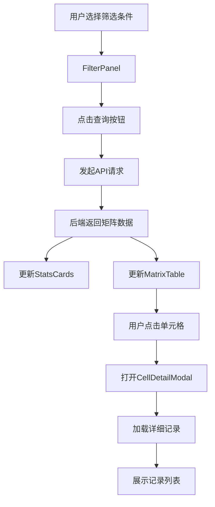

# 前端 Vue 3 组件设计

## 一、项目结构

```
frontend/
├── public/
│   └── index.html
├── src/
│   ├── main.js                          # 入口文件
│   ├── App.vue                          # 根组件
│   ├── api/
│   │   └── confusionMatrix.js           # API接口封装
│   ├── views/
│   │   └── ConfusionMatrixView.vue      # 主页面
│   ├── components/
│   │   ├── FilterPanel.vue              # 筛选面板组件
│   │   ├── MatrixTable.vue              # 混淆矩阵表格组件
│   │   ├── StatsCards.vue               # 统计卡片组件
│   │   └── CellDetailModal.vue          # 单元格详情模态框
│   ├── utils/
│   │   └── helpers.js                   # 工具函数
│   └── styles/
│       └── matrix.css                   # 样式文件
├── package.json
└── vite.config.js
```

---

## 二、核心组件设计

### 2.1 API接口封装

#### api/confusionMatrix.js

```javascript
import axios from 'axios';

const API_BASE = 'http://localhost:8080/api/confusion-matrix';

// 创建axios实例
const http = axios.create({
    baseURL: API_BASE,
    timeout: 30000,
    headers: {
        'Content-Type': 'application/json'
    }
});

// 响应拦截器
http.interceptors.response.use(
    response => response.data,
    error => {
        console.error('API Error:', error);
        return Promise.reject(error);
    }
);

export const confusionMatrixApi = {
    // 查询混淆矩阵
    queryMatrix(params) {
        return http.post('/query', params);
    },

    // 获取单元格详情
    getCellDetail(params, expectedValue, actualValue) {
        return http.post('/cell-detail', params, {
            params: { expectedValue, actualValue }
        });
    },

    // 导出Excel
    exportExcel(params) {
        return http.post('/export', params, {
            responseType: 'blob'
        });
    },

    // 获取筛选选项
    getFilterOptions() {
        return http.get('/filter-options');
    }
};
```

---

### 2.2 主视图组件

#### views/ConfusionMatrixView.vue

```vue
<template>
  <div class="confusion-matrix-page">
    <h1 class="page-title">🎯 分类预测混淆矩阵统计报表</h1>

    <!-- 筛选面板 -->
    <FilterPanel
      ref="filterPanel"
      @query="handleQuery"
      @reset="handleReset"
      @export="handleExport"
    />

    <!-- 加载中 -->
    <el-skeleton v-if="loading" :rows="10" animated />

    <!-- 统计卡片 -->
    <StatsCards
      v-else-if="matrixData"
      :total-count="matrixData.totalCount"
      :correct-count="matrixData.correctCount"
      :accuracy="matrixData.accuracy"
    />

    <!-- 混淆矩阵表格 -->
    <MatrixTable
      v-if="matrixData"
      :matrix-data="matrixData"
      @cell-click="handleCellClick"
    />

    <!-- 单元格详情模态框 -->
    <CellDetailModal
      v-model:visible="detailModalVisible"
      :cell-data="selectedCellData"
      :filter-params="currentFilters"
    />
  </div>
</template>

<script setup>
import { ref, onMounted } from 'vue';
import { ElMessage, ElSkeleton } from 'element-plus';
import FilterPanel from '@/components/FilterPanel.vue';
import StatsCards from '@/components/StatsCards.vue';
import MatrixTable from '@/components/MatrixTable.vue';
import CellDetailModal from '@/components/CellDetailModal.vue';
import { confusionMatrixApi } from '@/api/confusionMatrix';

const loading = ref(false);
const matrixData = ref(null);
const currentFilters = ref({});
const detailModalVisible = ref(false);
const selectedCellData = ref(null);
const filterPanel = ref(null);

// 查询混淆矩阵
const handleQuery = async (filters) => {
  loading.value = true;
  currentFilters.value = filters;

  try {
    const response = await confusionMatrixApi.queryMatrix(filters);
    matrixData.value = response;
    ElMessage.success('查询成功');
  } catch (error) {
    ElMessage.error('查询失败: ' + error.message);
  } finally {
    loading.value = false;
  }
};

// 重置筛选
const handleReset = () => {
  matrixData.value = null;
  currentFilters.value = {};
};

// 导出Excel
const handleExport = async (filters) => {
  try {
    const blob = await confusionMatrixApi.exportExcel(filters);
    const url = window.URL.createObjectURL(blob);
    const a = document.createElement('a');
    a.href = url;
    a.download = `confusion_matrix_${Date.now()}.xlsx`;
    a.click();
    window.URL.revokeObjectURL(url);
    ElMessage.success('导出成功');
  } catch (error) {
    ElMessage.error('导出失败: ' + error.message);
  }
};

// 单元格点击
const handleCellClick = (expectedValue, actualValue, count) => {
  if (count === 0) return;

  selectedCellData.value = {
    expectedValue,
    actualValue,
    count
  };
  detailModalVisible.value = true;
};

// 页面加载时初始化
onMounted(() => {
  // 可以加载默认筛选条件
  if (filterPanel.value) {
    filterPanel.value.loadDefaultFilters();
  }
});
</script>

<style scoped>
.confusion-matrix-page {
  max-width: 1800px;
  margin: 0 auto;
  padding: 30px;
  background: white;
  border-radius: 8px;
  box-shadow: 0 2px 8px rgba(0, 0, 0, 0.1);
}

.page-title {
  text-align: center;
  color: #333;
  margin-bottom: 30px;
  font-size: 28px;
}
</style>
```

---

### 2.3 筛选面板组件

#### components/FilterPanel.vue

```vue
<template>
  <div class="filter-panel">
    <el-form :model="filters" label-width="100px">
      <el-row :gutter="20">
        <el-col :span="6">
          <el-form-item label="一级分类">
            <el-select v-model="filters.primaryCategory" placeholder="请选择" clearable>
              <el-option label="服装" value="服装" />
              <el-option label="电子" value="电子" />
              <el-option label="食品" value="食品" />
            </el-select>
          </el-form-item>
        </el-col>

        <el-col :span="6">
          <el-form-item label="二级分类">
            <el-select v-model="filters.secondaryCategory" placeholder="请选择" clearable>
              <el-option label="上衣" value="上衣" />
              <el-option label="裤子" value="裤子" />
              <el-option label="鞋子" value="鞋子" />
            </el-select>
          </el-form-item>
        </el-col>

        <el-col :span="6">
          <el-form-item label="测试用例">
            <el-select v-model="filters.testCaseId" placeholder="请选择" clearable>
              <el-option
                v-for="item in filterOptions.testCases"
                :key="item.id"
                :label="item.name"
                :value="item.id"
              />
            </el-select>
          </el-form-item>
        </el-col>

        <el-col :span="6">
          <el-form-item label="应用场景">
            <el-select v-model="filters.scenarioId" placeholder="请选择" clearable>
              <el-option
                v-for="item in filterOptions.scenarios"
                :key="item.id"
                :label="item.name"
                :value="item.id"
              />
            </el-select>
          </el-form-item>
        </el-col>
      </el-row>

      <el-row :gutter="20">
        <el-col :span="6">
          <el-form-item label="垂类">
            <el-select v-model="filters.verticalCategoryId" placeholder="请选择" clearable>
              <el-option
                v-for="item in filterOptions.verticalCategories"
                :key="item.id"
                :label="item.name"
                :value="item.id"
              />
            </el-select>
          </el-form-item>
        </el-col>

        <el-col :span="6">
          <el-form-item label="因子">
            <el-select v-model="filters.factorId" placeholder="请选择" clearable @change="handleFactorChange">
              <el-option
                v-for="item in filterOptions.factors"
                :key="item.id"
                :label="item.name"
                :value="item.id"
              />
            </el-select>
          </el-form-item>
        </el-col>

        <el-col :span="6">
          <el-form-item label="因子值">
            <el-select v-model="filters.factorValueId" placeholder="请选择" clearable :disabled="!filters.factorId">
              <el-option
                v-for="item in currentFactorValues"
                :key="item.id"
                :label="item.displayName || item.value"
                :value="item.id"
              />
            </el-select>
          </el-form-item>
        </el-col>

        <el-col :span="6">
          <el-form-item label=" ">
            <el-button type="primary" icon="Search" @click="handleQuery">查询</el-button>
            <el-button type="success" icon="Download" @click="handleExport">导出</el-button>
            <el-button icon="Refresh" @click="handleReset">重置</el-button>
          </el-form-item>
        </el-col>
      </el-row>
    </el-form>
  </div>
</template>

<script setup>
import { ref, computed, onMounted } from 'vue';
import { confusionMatrixApi } from '@/api/confusionMatrix';

const emit = defineEmits(['query', 'reset', 'export']);

const filters = ref({
  primaryCategory: '',
  secondaryCategory: '',
  testCaseId: null,
  scenarioId: null,
  verticalCategoryId: null,
  factorId: null,
  factorValueId: null
});

const filterOptions = ref({
  testCases: [],
  scenarios: [],
  verticalCategories: [],
  factors: [],
  factorValues: {}  // 按factorId分组的因子值
});

// 当前因子的因子值
const currentFactorValues = computed(() => {
  if (!filters.value.factorId) return [];
  return filterOptions.value.factorValues[filters.value.factorId] || [];
});

// 查询
const handleQuery = () => {
  emit('query', { ...filters.value });
};

// 导出
const handleExport = () => {
  emit('export', { ...filters.value });
};

// 重置
const handleReset = () => {
  filters.value = {
    primaryCategory: '',
    secondaryCategory: '',
    testCaseId: null,
    scenarioId: null,
    verticalCategoryId: null,
    factorId: null,
    factorValueId: null
  };
  emit('reset');
};

// 因子变化时清空因子值
const handleFactorChange = () => {
  filters.value.factorValueId = null;
};

// 加载筛选选项
const loadFilterOptions = async () => {
  try {
    const options = await confusionMatrixApi.getFilterOptions();
    filterOptions.value = options;
  } catch (error) {
    console.error('加载筛选选项失败:', error);
  }
};

// 加载默认筛选条件
const loadDefaultFilters = () => {
  filters.value.primaryCategory = '服装';
  filters.value.secondaryCategory = '上衣';
  handleQuery();
};

onMounted(() => {
  loadFilterOptions();
});

defineExpose({
  loadDefaultFilters
});
</script>

<style scoped>
.filter-panel {
  background: #fafafa;
  padding: 20px;
  border-radius: 6px;
  margin-bottom: 30px;
}

:deep(.el-form-item) {
  margin-bottom: 15px;
}

:deep(.el-select) {
  width: 100%;
}
</style>
```

---

### 2.4 统计卡片组件

#### components/StatsCards.vue

```vue
<template>
  <div class="stats-cards">
    <div class="stat-card purple">
      <div class="stat-value">{{ totalCount.toLocaleString() }}</div>
      <div class="stat-label">总样本数</div>
    </div>

    <div class="stat-card green">
      <div class="stat-value">{{ correctCount.toLocaleString() }}</div>
      <div class="stat-label">预测正确数</div>
    </div>

    <div class="stat-card orange">
      <div class="stat-value">{{ (accuracy * 100).toFixed(2) }}%</div>
      <div class="stat-label">总准确率</div>
    </div>
  </div>
</template>

<script setup>
defineProps({
  totalCount: {
    type: Number,
    required: true
  },
  correctCount: {
    type: Number,
    required: true
  },
  accuracy: {
    type: Number,
    required: true
  }
});
</script>

<style scoped>
.stats-cards {
  display: flex;
  gap: 20px;
  margin-bottom: 30px;
}

.stat-card {
  flex: 1;
  color: white;
  padding: 30px;
  border-radius: 8px;
  text-align: center;
  box-shadow: 0 4px 12px rgba(0, 0, 0, 0.15);
}

.stat-card.purple {
  background: linear-gradient(135deg, #667eea 0%, #764ba2 100%);
}

.stat-card.green {
  background: linear-gradient(135deg, #11998e 0%, #38ef7d 100%);
}

.stat-card.orange {
  background: linear-gradient(135deg, #ee0979 0%, #ff6a00 100%);
}

.stat-value {
  font-size: 40px;
  font-weight: bold;
  margin-bottom: 10px;
}

.stat-label {
  font-size: 16px;
  opacity: 0.9;
}
</style>
```

---

### 2.5 混淆矩阵表格组件

#### components/MatrixTable.vue

```vue
<template>
  <div class="matrix-wrapper">
    <el-table
      :data="tableData"
      border
      :header-cell-style="{ background: '#409EFF', color: 'white', textAlign: 'center' }"
      :cell-style="getCellStyle"
      style="width: 100%"
    >
      <el-table-column label="实际\预测" width="100" fixed>
        <template #default="{ row }">
          <strong>{{ row.label }}</strong>
        </template>
      </el-table-column>

      <el-table-column
        v-for="i in 16"
        :key="i"
        :label="`预测${i - 1}`"
        width="70"
        align="center"
      >
        <template #default="{ row, $index }">
          <div
            class="matrix-cell"
            :class="getCellClass($index, i - 1, row[`col${i - 1}`])"
            @click="handleCellClick($index, i - 1, row[`col${i - 1}`])"
          >
            {{ row[`col${i - 1}`] }}
          </div>
        </template>
      </el-table-column>

      <el-table-column label="SUM" width="80" align="center" fixed="right">
        <template #default="{ row }">
          <strong>{{ row.sum }}</strong>
        </template>
      </el-table-column>

      <el-table-column label="召回率" width="100" align="center" fixed="right">
        <template #default="{ row }">
          <span :style="{ color: getRecallColor(row.recall) }">
            <strong>{{ row.recall }}%</strong>
          </span>
        </template>
      </el-table-column>
    </el-table>

    <!-- 汇总行 -->
    <div class="summary-rows">
      <el-table :data="[sumRow, precisionRow]" border>
        <el-table-column label="" width="100">
          <template #default="{ row }">
            <strong>{{ row.label }}</strong>
          </template>
        </el-table-column>

        <el-table-column
          v-for="i in 16"
          :key="i"
          :label="`预测${i - 1}`"
          width="70"
          align="center"
        >
          <template #default="{ row }">
            {{ row[`col${i - 1}`] }}
          </template>
        </el-table-column>

        <el-table-column label="总计" width="180" align="center">
          <template #default="{ row }">
            <strong>{{ row.total }}</strong>
          </template>
        </el-table-column>
      </el-table>
    </div>
  </div>
</template>

<script setup>
import { computed } from 'vue';

const props = defineProps({
  matrixData: {
    type: Object,
    required: true
  }
});

const emit = defineEmits(['cell-click']);

// 构建表格数据
const tableData = computed(() => {
  const data = [];
  for (let i = 0; i < 16; i++) {
    const row = { label: `实际为${i}` };
    let sum = 0;

    for (let j = 0; j < 16; j++) {
      const value = props.matrixData.matrix[i][j];
      row[`col${j}`] = value;
      sum += value;
    }

    row.sum = sum;
    row.recall = props.matrixData.rowSummaries[i].recallRate.toFixed(2);
    data.push(row);
  }
  return data;
});

// SUM行
const sumRow = computed(() => {
  const row = { label: 'SUM' };
  let total = 0;

  for (let j = 0; j < 16; j++) {
    const colSum = props.matrixData.columnSummaries[j].total;
    row[`col${j}`] = colSum;
    total += colSum;
  }

  row.total = `总计: ${total}`;
  return row;
});

// 精准率行
const precisionRow = computed(() => {
  const row = { label: '精准率' };
  for (let j = 0; j < 16; j++) {
    const precision = props.matrixData.columnSummaries[j].precisionRate;
    row[`col${j}`] = `${(precision * 100).toFixed(2)}%`;
  }
  row.total = `准确率: ${(props.matrixData.accuracy * 100).toFixed(2)}%`;
  return row;
});

// 单元格样式
const getCellClass = (rowIndex, colIndex, value) => {
  if (value === 0) return 'cell-zero';
  if (rowIndex === colIndex) return 'cell-correct';
  return 'cell-error';
};

const getCellStyle = ({ rowIndex, columnIndex }) => {
  // 可以在这里添加更多样式逻辑
  return {};
};

// 召回率颜色
const getRecallColor = (recall) => {
  const rate = parseFloat(recall);
  if (rate >= 90) return '#2e7d32';
  if (rate >= 70) return '#f57c00';
  return '#c62828';
};

// 单元格点击
const handleCellClick = (expected, actual, count) => {
  emit('cell-click', expected, actual, count);
};
</script>

<style scoped>
.matrix-wrapper {
  overflow-x: auto;
  margin-bottom: 30px;
}

.matrix-cell {
  cursor: pointer;
  padding: 8px;
  transition: all 0.2s;
}

.matrix-cell:hover {
  transform: scale(1.1);
  box-shadow: 0 2px 8px rgba(0, 0, 0, 0.15);
}

.cell-correct {
  background: #d4edda !important;
  color: #155724;
  font-weight: bold;
}

.cell-error {
  background: #fff3cd;
  color: #856404;
}

.cell-zero {
  background: #f8f9fa;
  color: #aaa;
}

.summary-rows {
  margin-top: 10px;
}
</style>
```

---

### 2.6 单元格详情模态框

#### components/CellDetailModal.vue

```vue
<template>
  <el-dialog
    v-model="dialogVisible"
    title="🔍 单元格详细数据"
    width="80%"
    :before-close="handleClose"
  >
    <div v-if="cellData" class="modal-content">
      <el-descriptions :column="3" border>
        <el-descriptions-item label="实际值">{{ cellData.expectedValue }}</el-descriptions-item>
        <el-descriptions-item label="预测值">{{ cellData.actualValue }}</el-descriptions-item>
        <el-descriptions-item label="记录数">{{ cellData.count }}</el-descriptions-item>
      </el-descriptions>

      <el-table
        v-loading="loading"
        :data="detailRecords"
        border
        style="margin-top: 20px"
        max-height="500"
      >
        <el-table-column type="index" label="序号" width="60" />
        <el-table-column prop="primaryCategory" label="一级分类" width="100" />
        <el-table-column prop="secondaryCategory" label="二级分类" width="100" />
        <el-table-column prop="expectedValue" label="预期值" width="80" align="center" />
        <el-table-column prop="actualValue" label="实际值" width="80" align="center" />
        <el-table-column prop="status" label="状态" width="80" align="center">
          <template #default="{ row }">
            <el-tag :type="row.status === 'pass' ? 'success' : 'danger'">
              {{ row.status.toUpperCase() }}
            </el-tag>
          </template>
        </el-table-column>
        <el-table-column prop="testCaseName" label="测试用例" width="150" />
        <el-table-column prop="scenarioName" label="应用场景" width="150" />
        <el-table-column prop="createTime" label="创建时间" width="180" />
      </el-table>
    </div>

    <template #footer>
      <el-button @click="handleClose">关闭</el-button>
    </template>
  </el-dialog>
</template>

<script setup>
import { ref, watch } from 'vue';
import { confusionMatrixApi } from '@/api/confusionMatrix';
import { ElMessage } from 'element-plus';

const props = defineProps({
  visible: Boolean,
  cellData: Object,
  filterParams: Object
});

const emit = defineEmits(['update:visible']);

const dialogVisible = ref(false);
const loading = ref(false);
const detailRecords = ref([]);

watch(() => props.visible, (newVal) => {
  dialogVisible.value = newVal;
  if (newVal && props.cellData) {
    loadDetailRecords();
  }
});

watch(dialogVisible, (newVal) => {
  emit('update:visible', newVal);
});

const loadDetailRecords = async () => {
  loading.value = true;
  try {
    const response = await confusionMatrixApi.getCellDetail(
      props.filterParams,
      props.cellData.expectedValue,
      props.cellData.actualValue
    );
    detailRecords.value = response.records;
  } catch (error) {
    ElMessage.error('加载详细数据失败: ' + error.message);
  } finally {
    loading.value = false;
  }
};

const handleClose = () => {
  dialogVisible.value = false;
};
</script>

<style scoped>
.modal-content {
  padding: 20px 0;
}
</style>
```

---

## 三、工具函数

#### utils/helpers.js

```javascript
// 格式化百分比
export function formatPercent(value, decimals = 2) {
  return `${(value * 100).toFixed(decimals)}%`;
}

// 获取召回率样式类
export function getRecallClass(rate) {
  if (rate >= 0.9) return 'recall-high';
  if (rate >= 0.7) return 'recall-medium';
  return 'recall-low';
}

// 获取召回率颜色
export function getRecallColor(rate) {
  if (rate >= 0.9) return '#2e7d32';
  if (rate >= 0.7) return '#f57c00';
  return '#c62828';
}

// 下载文件
export function downloadFile(blob, filename) {
  const url = window.URL.createObjectURL(blob);
  const a = document.createElement('a');
  a.href = url;
  a.download = filename;
  document.body.appendChild(a);
  a.click();
  document.body.removeChild(a);
  window.URL.revokeObjectURL(url);
}
```

---

## 四、依赖配置

#### package.json

```json
{
  "name": "confusion-matrix-frontend",
  "version": "1.0.0",
  "scripts": {
    "dev": "vite",
    "build": "vite build",
    "preview": "vite preview"
  },
  "dependencies": {
    "vue": "^3.3.4",
    "axios": "^1.5.0",
    "element-plus": "^2.4.0",
    "@element-plus/icons-vue": "^2.1.0"
  },
  "devDependencies": {
    "@vitejs/plugin-vue": "^4.3.4",
    "vite": "^4.4.9"
  }
}
```

#### vite.config.js

```javascript
import { defineConfig } from 'vite';
import vue from '@vitejs/plugin-vue';
import { resolve } from 'path';

export default defineConfig({
  plugins: [vue()],
  resolve: {
    alias: {
      '@': resolve(__dirname, 'src')
    }
  },
  server: {
    port: 3000,
    proxy: {
      '/api': {
        target: 'http://localhost:8080',
        changeOrigin: true
      }
    }
  }
});
```

---

## 五、组件交互流程



---

**下一步**: 查看 [05-完整架构图.md](05-完整架构图.md)
