# 系统架构与流程图

## 一、系统整体架构

```mermaid
graph TB
    subgraph "前端层 Frontend"
        A1[Vue 3 应用]
        A2[Element Plus UI]
        A3[Axios HTTP客户端]
        A1 --> A2
        A1 --> A3
    end

    subgraph "后端层 Backend"
        B1[Spring Boot应用]
        B2[Controller层<br/>REST API]
        B3[Service层<br/>业务逻辑]
        B4[DAO层<br/>MyBatis Mapper]
        B5[Excel导出服务<br/>Apache POI]

        B1 --> B2
        B2 --> B3
        B3 --> B4
        B3 --> B5
    end

    subgraph "数据层 Database"
        C1[(MySQL 8.0)]
        C2[classification_record<br/>分类记录表]
        C3[test_case<br/>用例表]
        C4[scenario<br/>场景表]
        C5[vertical_category<br/>垂类表]
        C6[factor<br/>因子表]
        C7[factor_value<br/>因子值表]

        C1 --> C2
        C1 --> C3
        C1 --> C4
        C1 --> C5
        C1 --> C6
        C1 --> C7
    end

    A3 -->|HTTP/JSON| B2
    B4 --> C1
    B5 -.->|生成Excel文件| A3

    style A1 fill:#409EFF,color:#fff
    style B1 fill:#67C23A,color:#fff
    style C1 fill:#E6A23C,color:#fff
```

---

## 二、数据流转流程

### 2.1 查询混淆矩阵流程

```mermaid
sequenceDiagram
    actor User as 用户
    participant UI as 前端页面
    participant Filter as 筛选组件
    participant API as API接口
    participant Controller as Controller
    participant Service as Service
    participant Mapper as MyBatis
    participant DB as 数据库

    User->>UI: 访问页面
    UI->>Filter: 加载筛选选项
    Filter->>API: GET /filter-options
    API->>Controller: getFilterOptions()
    Controller->>Service: getFilterOptions()
    Service->>Mapper: 查询用例/场景/垂类/因子
    Mapper->>DB: SELECT * FROM test_case...
    DB-->>Mapper: 返回选项数据
    Mapper-->>Service: List<TestCase>...
    Service-->>Controller: FilterOptions
    Controller-->>API: JSON响应
    API-->>Filter: 筛选选项数据
    Filter-->>UI: 渲染下拉框

    User->>Filter: 选择筛选条件
    User->>Filter: 点击"查询"按钮
    Filter->>API: POST /query<br/>{primaryCategory, testCaseId...}
    API->>Controller: queryMatrix(request)
    Controller->>Service: generateMatrix(request)

    Note over Service: 开始生成混淆矩阵

    Service->>Mapper: queryMatrixData(request)
    Mapper->>DB: SELECT expected_value, actual_value, COUNT(*)<br/>FROM classification_record<br/>WHERE ... GROUP BY ...
    DB-->>Mapper: 聚合结果
    Mapper-->>Service: List<Map> 原始数据

    Note over Service: 处理数据

    Service->>Service: 1. 初始化16x16矩阵
    Service->>Service: 2. 填充矩阵数据
    Service->>Service: 3. 计算每行召回率
    Service->>Service: 4. 计算每列精准率
    Service->>Service: 5. 计算总准确率

    Service-->>Controller: MatrixResponse
    Controller-->>API: JSON响应
    API-->>UI: 矩阵数据

    UI->>UI: 更新统计卡片
    UI->>UI: 渲染混淆矩阵表格

    UI-->>User: 显示结果
```

---

### 2.2 单元格详情查询流程

```mermaid
sequenceDiagram
    actor User as 用户
    participant Table as 矩阵表格
    participant Modal as 详情弹窗
    participant API as API接口
    participant Service as Service
    participant DB as 数据库

    User->>Table: 点击单元格 (实际5, 预测3)
    Table->>Modal: 打开弹窗<br/>cellClick(5, 3, 10)
    Modal->>API: POST /cell-detail<br/>{expectedValue: 5, actualValue: 3}
    API->>Service: getCellDetail(request, 5, 3)
    Service->>DB: SELECT *<br/>FROM classification_record<br/>WHERE expected_value=5<br/>AND actual_value=3<br/>LIMIT 1000
    DB-->>Service: List<ClassificationRecord>
    Service-->>API: MatrixCellDetail<br/>{count: 10, records: [...]}
    API-->>Modal: JSON数据
    Modal->>Modal: 渲染详细记录表格
    Modal-->>User: 显示详细数据
```

---

### 2.3 Excel导出流程

```mermaid
sequenceDiagram
    actor User as 用户
    participant Filter as 筛选组件
    participant API as API接口
    participant Service as Service
    participant POI as Apache POI
    participant Browser as 浏览器

    User->>Filter: 点击"导出Excel"按钮
    Filter->>API: POST /export<br/>{筛选条件}
    API->>Service: exportToExcel(matrixData, outputStream)

    Note over Service,POI: 生成Excel文件

    Service->>Service: generateMatrix(request)
    Service->>POI: 创建Workbook
    POI->>POI: 创建Sheet("混淆矩阵")
    POI->>POI: 写入标题行
    POI->>POI: 写入表头
    POI->>POI: 写入16x16矩阵数据
    POI->>POI: 设置单元格样式<br/>(对角线绿色,其他橙色)
    POI->>POI: 写入SUM行
    POI->>POI: 写入精准率行
    POI-->>Service: Workbook对象

    Service->>Service: workbook.write(outputStream)
    Service-->>API: 文件流(Blob)

    API-->>Browser: Content-Type: application/vnd...xlsx<br/>Content-Disposition: attachment
    Browser->>Browser: 触发文件下载
    Browser-->>User: 下载 confusion_matrix.xlsx
```

---

## 三、前端组件架构

```mermaid
graph TD
    A[App.vue<br/>根组件] --> B[ConfusionMatrixView.vue<br/>主页面]

    B --> C[FilterPanel.vue<br/>筛选面板]
    B --> D[StatsCards.vue<br/>统计卡片]
    B --> E[MatrixTable.vue<br/>混淆矩阵表格]
    B --> F[CellDetailModal.vue<br/>详情弹窗]

    C --> G[confusionMatrixApi<br/>API封装]
    E --> G
    F --> G

    G --> H[Axios HTTP客户端]

    style A fill:#409EFF,color:#fff
    style B fill:#67C23A,color:#fff
    style C fill:#E6A23C,color:#fff
    style D fill:#E6A23C,color:#fff
    style E fill:#E6A23C,color:#fff
    style F fill:#E6A23C,color:#fff
```

---

## 四、后端分层架构

```mermaid
graph LR
    subgraph "Controller层"
        A1[ConfusionMatrixController]
        A1 --> A2["/api/confusion-matrix/query"]
        A1 --> A3["/api/confusion-matrix/cell-detail"]
        A1 --> A4["/api/confusion-matrix/export"]
        A1 --> A5["/api/confusion-matrix/filter-options"]
    end

    subgraph "Service层"
        B1[ConfusionMatrixService接口]
        B2[ConfusionMatrixServiceImpl实现]
        B1 --> B2
    end

    subgraph "DAO层"
        C1[ClassificationRecordMapper接口]
        C2[ClassificationRecordMapper.xml]
        C1 --> C2
    end

    subgraph "实体层"
        D1[ClassificationRecord]
        D2[TestCase/Scenario...]
        D3[QueryRequest/MatrixResponse DTO]
    end

    A1 --> B1
    B2 --> C1
    C2 --> E[(MySQL)]

    style A1 fill:#409EFF,color:#fff
    style B2 fill:#67C23A,color:#fff
    style C1 fill:#E6A23C,color:#fff
```

---

## 五、数据库ER图

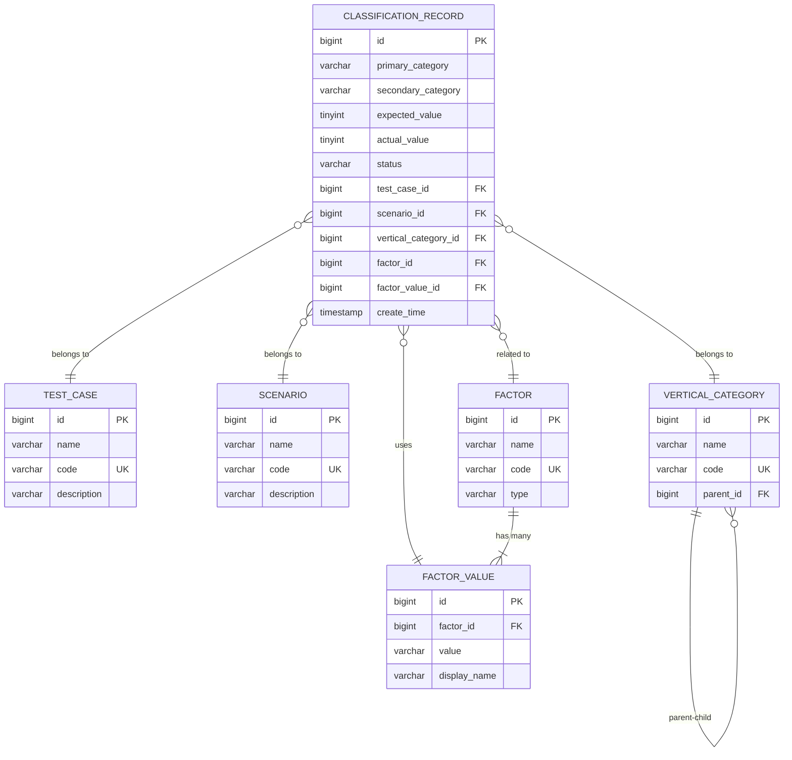

---

## 六、混淆矩阵计算逻辑

```mermaid
flowchart TD
    Start([开始]) --> Input[接收筛选条件<br/>QueryRequest]
    Input --> Query["执行SQL聚合查询<br/>GROUP BY expected_value, actual_value"]
    Query --> Init["初始化16x16矩阵<br/>matrix = new Integer[16][16]"]

    Init --> Fill{遍历查询结果}
    Fill -->|每条记录| SetCell["matrix[expected][actual] = count"]
    SetCell --> Fill

    Fill -->|结束| CalcRow{"计算行统计<br/>for i=0 to 15"}
    CalcRow -->|每行| RowSum["rowSum = Σ matrix[i][j]"]
    RowSum --> Recall["recallRate = matrix[i][i] / rowSum"]
    Recall --> CalcRow

    CalcRow -->|结束| CalcCol{"计算列统计<br/>for j=0 to 15"}
    CalcCol -->|每列| ColSum["colSum = Σ matrix[i][j]"]
    ColSum --> Precision["precisionRate = matrix[j][j] / colSum"]
    Precision --> CalcCol

    CalcCol -->|结束| Total["totalCount = Σ Σ matrix[i][j]"]
    Total --> Correct["correctCount = Σ matrix[i][i]"]
    Correct --> Accuracy[accuracy = correctCount / totalCount]

    Accuracy --> Return[返回MatrixResponse]
    Return --> End([结束])

    style Start fill:#67C23A,color:#fff
    style End fill:#F56C6C,color:#fff
    style Return fill:#409EFF,color:#fff
```

---

## 七、召回率与精准率计算公式

### 7.1 召回率 (Recall) - 行统计

对于实际标签 `i`:

```
召回率(i) = 正确预测数 / 实际总数
         = matrix[i][i] / Σ(matrix[i][j]), j=0..15
```

**示例**:
- 实际为5的样本有100个
- 其中80个被正确预测为5
- 召回率 = 80 / 100 = 80%

### 7.2 精准率 (Precision) - 列统计

对于预测标签 `j`:

```
精准率(j) = 正确预测数 / 预测总数
         = matrix[j][j] / Σ(matrix[i][j]), i=0..15
```

**示例**:
- 预测为5的样本有120个
- 其中80个实际确实是5
- 精准率 = 80 / 120 = 66.7%

### 7.3 总准确率 (Accuracy)

```
总准确率 = 所有正确预测数 / 总样本数
        = Σ(matrix[i][i]) / Σ Σ(matrix[i][j])
```

---

## 八、混淆矩阵可视化示例

```
一级分类: 服装  |  二级分类: 上衣

              预测0  预测1  预测2  ...  预测15  │ SUM   召回率
          ────────────────────────────────────┼─────────────
实际0        45      3      1    ...    0     │  50    90%   ✅
实际1         2     38      0    ...    0     │  40    95%   ✅
实际2         1      0     35    ...    0     │  38    92%   ✅
...         ...    ...    ...    ...   ...    │ ...    ...
实际15        0      0      1    ...   28     │  30    93%   ✅
          ────────────────────────────────────┼─────────────
SUM          52     45     42    ...   30     │ 500
精准率       86%    84%    83%   ...   93%    │ 总准确率: 92%
            ✅     ✅     ✅          ✅
```

**颜色编码**:
- 🟢 **对角线** (实际=预测): 绿色背景 - 预测正确
- 🟠 **非对角线**: 橙色背景 - 预测错误
- ⚪ **0值**: 灰色背景 - 无数据

---

## 九、系统部署架构

```mermaid
graph TB
    subgraph "生产环境"
        subgraph "前端服务器"
            A1[Nginx<br/>端口: 80/443]
            A2[Vue静态文件]
            A1 --> A2
        end

        subgraph "后端服务器"
            B1[Tomcat/Spring Boot<br/>端口: 8080]
            B2[JVM<br/>Heap: 2GB]
            B1 --> B2
        end

        subgraph "数据库服务器"
            C1[MySQL 8.0<br/>端口: 3306]
            C2[主从复制]
            C1 --> C2
        end

        subgraph "缓存服务器(可选)"
            D1[Redis<br/>端口: 6379]
        end
    end

    A1 -->|反向代理/api/*| B1
    B1 --> C1
    B1 -.->|热点数据缓存| D1

    style A1 fill:#409EFF,color:#fff
    style B1 fill:#67C23A,color:#fff
    style C1 fill:#E6A23C,color:#fff
    style D1 fill:#F56C6C,color:#fff
```

---

## 十、性能优化策略

```mermaid
graph TB
    Root[性能优化] --> A[前端优化]
    Root --> B[后端优化]
    Root --> C[数据库优化]
    Root --> D[缓存优化]

    A --> A1[虚拟滚动]
    A --> A2[懒加载]
    A --> A3[组件缓存]
    A --> A4[CDN加速]

    B --> B1[SQL索引优化]
    B --> B2[数据库连接池]
    B --> B3[异步处理]
    B --> B4[分页查询]

    C --> C1[预聚合表]
    C --> C2[物化视图]
    C --> C3[分库分表]
    C --> C4[读写分离]

    D --> D1[Redis缓存]
    D --> D2[本地缓存]
    D --> D3[缓存预热]
    D --> D4[过期策略]

    style Root fill:#409EFF,color:#fff
    style A fill:#67C23A,color:#fff
    style B fill:#E6A23C,color:#fff
    style C fill:#F56C6C,color:#fff
    style D fill:#909399,color:#fff
```

---

## 十一、开发与部署流程

```mermaid
graph LR
    A[初始化项目] --> B[数据库表设计]
    B --> C[后端开发]
    B --> D[前端开发]

    C --> C1[实现Entity]
    C1 --> C2[实现Mapper]
    C2 --> C3[实现Service]
    C3 --> C4[实现Controller]
    C4 --> C5[编写单元测试]

    D --> D1[创建Vue项目]
    D1 --> D2[实现API封装]
    D2 --> D3[实现组件]
    D3 --> D4[集成Element Plus]

    C5 --> E[后端v1.0]
    D4 --> F[前端v1.0]

    E --> G[集成测试]
    F --> G
    G --> H[生产部署 v1.0-release]

    style A fill:#67C23A,color:#fff
    style B fill:#409EFF,color:#fff
    style C fill:#E6A23C,color:#fff
    style D fill:#E6A23C,color:#fff
    style E fill:#909399,color:#fff
    style F fill:#909399,color:#fff
    style G fill:#F56C6C,color:#fff
    style H fill:#F56C6C,color:#fff
```

---

**总结**: 本系统是一个典型的**前后端分离架构**,采用**Vue 3 + Spring Boot + MySQL**技术栈,核心功能是通过**混淆矩阵**可视化分类模型的预测效果,并提供灵活的多维度筛选和Excel导出功能。
