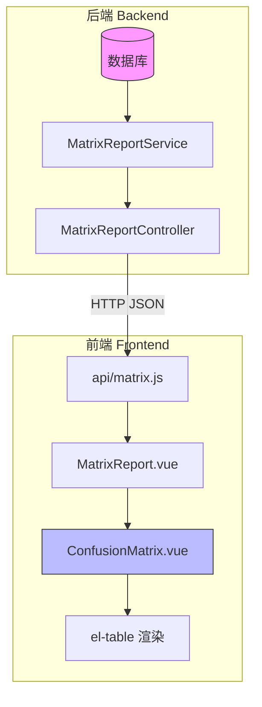
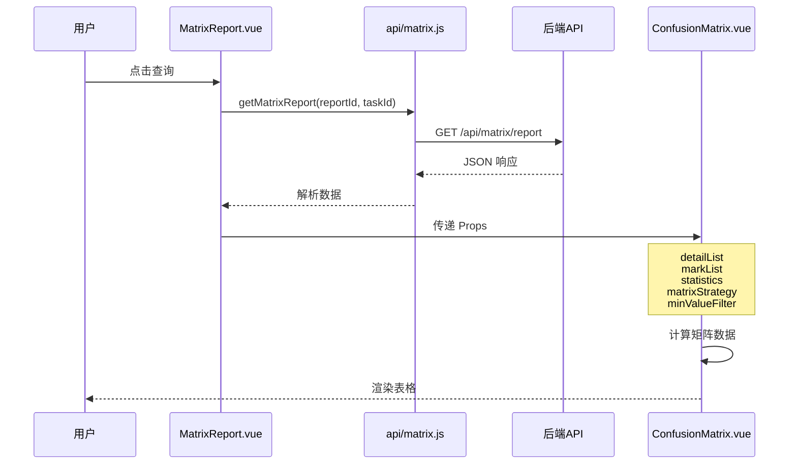
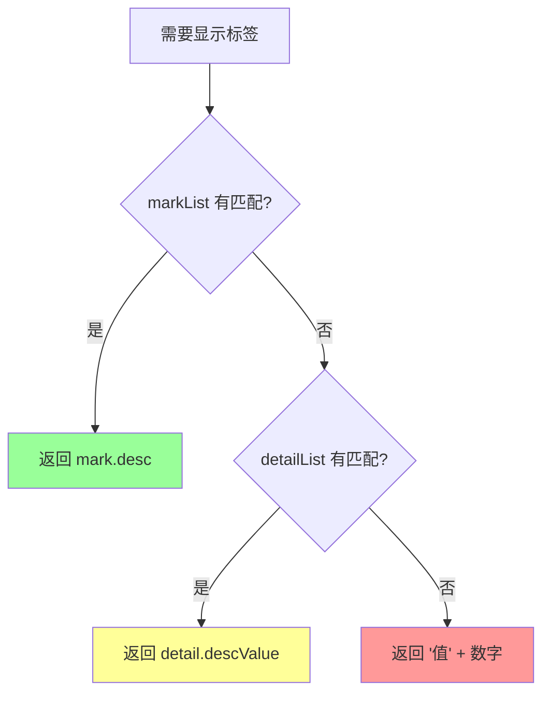
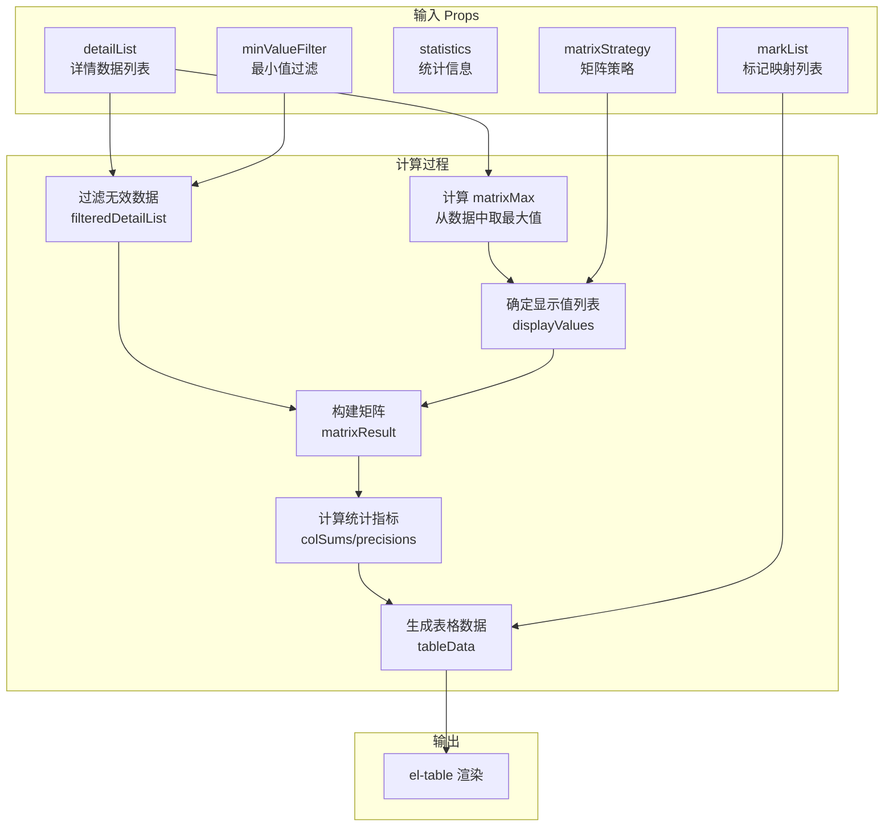
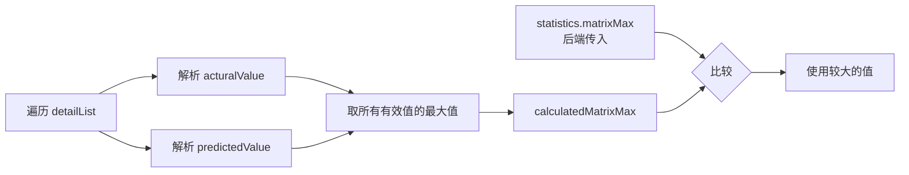
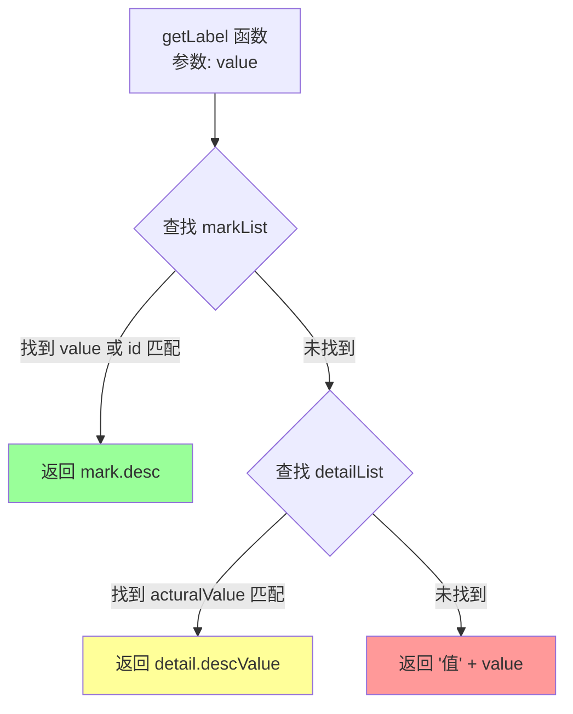

# 后端开发者指南 - 混淆矩阵数据格式说明

> 本文档面向后端开发者，详细说明前端组件需要的数据格式和计算逻辑。

## 目录

1. [整体架构](#1-整体架构)
2. [API数据格式](#2-api数据格式)
3. [数据流转图](#3-数据流转图)
4. [参数详解](#4-参数详解)
5. [计算逻辑说明](#5-计算逻辑说明)
6. [调试方法](#6-调试方法)
7. [常见问题](#7-常见问题)

---

## 1. 整体架构

### 1.1 系统架构图



### 1.2 数据流向



---

## 2. API数据格式

### 2.1 请求格式

```http
GET /api/matrix/report?reportId=RPT001&taskId=TASK001
```

### 2.2 响应格式

```json
{
  "code": 200,
  "message": "success",
  "data": [
    {
      "caseConfig": {
        "reportId": "RPT001",
        "taskId": "TASK001",
        "caseId": "CASE_001",
        "matrixStrategy": "1",
        "minValueFilter": 0
      },
      "detailList": [
        // 详情数据，见下文
      ],
      "markList": [
        // 标记映射，见下文
      ],
      "statistics": {
        // 统计信息，见下文
      }
    }
  ]
}
```

### 2.3 detailList 数据格式（核心）

这是最重要的数据，每条记录代表一个样本的实际值和预测值：

```json
{
  "detailList": [
    {
      "corpusId": "QA_12345",        // 语料ID，唯一标识
      "acturalValue": "1",           // 【必须】实际值，字符串格式的整数
      "predictedValue": "2",         // 【必须】预测值，字符串格式的整数
      "descValue": "天气查询",       // 【可选】描述值，用于显示说明
      "createTime": "2025-12-06 10:30:00"  // 【可选】创建时间
    },
    {
      "corpusId": "QA_12346",
      "acturalValue": "1",
      "predictedValue": "1",         // 预测正确（实际=预测）
      "descValue": "天气查询",
      "createTime": "2025-12-06 10:31:00"
    }
  ]
}
```

**字段说明**：

| 字段名 | 类型 | 必填 | 说明 |
|--------|------|------|------|
| corpusId | String | 是 | 语料唯一标识 |
| acturalValue | String | 是 | 实际分类值，必须可转为整数 |
| predictedValue | String | 是 | 预测分类值，必须可转为整数 |
| descValue | String | 否 | 描述文本，用于显示说明列 |
| createTime | String | 否 | 创建时间 |

**注意事项**：
- `acturalValue` 和 `predictedValue` 虽然是字符串，但必须能转换为整数（如 "1", "2", "10"）
- 无效值（如 "N/A", "", "-1"）会被过滤，不参与矩阵计算

### 2.4 markList 数据格式

用于将数值映射为可读的显示名称：

```json
{
  "markList": [
    { "id": "1", "value": "1", "desc": "天气查询" },
    { "id": "2", "value": "2", "desc": "知识问答" },
    { "id": "3", "value": "3", "desc": "音乐播放" },
    { "id": "4", "value": "4", "desc": "新闻资讯" },
    { "id": "5", "value": "5", "desc": "闲聊对话" }
  ]
}
```

**取值逻辑**（优先级从高到低）：



### 2.5 statistics 数据格式（可选）

统计信息，前端会自动计算，但后端可以传递预计算的值：

```json
{
  "statistics": {
    "totalCount": 200,      // 总样本数
    "validCount": 190,      // 有效样本数
    "invalidCount": 10,     // 无效样本数
    "correctCount": 150,    // 预测正确数
    "accuracy": 78.95       // 准确率百分比
  }
}
```

**⚠️ 重要说明**：
- `matrixMax` 字段已废弃，前端现在从 detailList 数据中自动计算最大值
- 前端会取所有 `acturalValue` 和 `predictedValue` 的最大值作为矩阵大小

### 2.6 caseConfig 数据格式

用例配置信息：

```json
{
  "caseConfig": {
    "reportId": "RPT001",
    "taskId": "TASK001",
    "caseId": "CASE_001",
    "acturalValueField": "intent_actual",     // 原始字段名（可选）
    "predictedValueField": "intent_predicted", // 原始字段名（可选）
    "matrixStrategy": "1",    // "1"=完整矩阵, "2"=稀疏矩阵
    "minValueFilter": 0,      // 最小值过滤，只显示大于此值的分类
    "createTime": "2025-12-06 10:00:00",
    "updateTime": "2025-12-06 10:00:00"
  }
}
```

---

## 3. 数据流转图

### 3.1 组件数据流转



### 3.2 矩阵最大值计算流程



### 3.3 标签取值流程



---

## 4. 参数详解

### 4.1 ConfusionMatrix 组件 Props

| 参数名 | 类型 | 默认值 | 说明 |
|--------|------|--------|------|
| detailList | Array | [] | 详情数据列表，**核心数据** |
| markList | Array | [] | 标记映射列表，用于显示说明 |
| statistics | Object | {} | 统计信息（可选） |
| matrixStrategy | String | "1" | 矩阵策略：1=完整，2=稀疏 |
| minValueFilter | Number | 0 | 最小值过滤阈值 |

### 4.2 matrixStrategy 参数说明

| 值 | 名称 | 说明 | 矩阵大小 |
|----|------|------|----------|
| "1" | 完整矩阵 | 显示从 minValueFilter+1 到最大值的所有分类 | maxValue - minValueFilter |
| "2" | 稀疏矩阵 | 只显示数据中实际出现的分类值 | 出现的唯一值数量 |

**示例对比**：

假设数据中出现的值：acturalValue = [1, 3, 5], predictedValue = [1, 2, 5]

- **策略1（完整矩阵）**：显示 1, 2, 3, 4, 5（5x5 矩阵）
- **策略2（稀疏矩阵）**：显示 1, 2, 3, 5（4x4 矩阵，跳过4因为没出现）

### 4.3 minValueFilter 参数说明

用于过滤掉小于等于指定值的分类：

| minValueFilter | 效果 |
|----------------|------|
| 0 | 显示 > 0 的值（1, 2, 3...） |
| -1 | 显示 > -1 的值（0, 1, 2...） |
| 1 | 显示 > 1 的值（2, 3, 4...） |

---

## 5. 计算逻辑说明

### 5.1 矩阵构建过程

```javascript
// 伪代码说明

// 1. 确定矩阵大小
matrixMax = max(所有acturalValue, 所有predictedValue)
displayValues = [minValueFilter+1, minValueFilter+2, ..., matrixMax]
// 例如: minValueFilter=0, matrixMax=5 → displayValues = [1,2,3,4,5]

// 2. 初始化矩阵
matrix = 5x5 的全0数组

// 3. 遍历数据，填充矩阵
for each detail in detailList:
    actual = parseInt(detail.acturalValue)    // 例如: 2
    predicted = parseInt(detail.predictedValue) // 例如: 3
    
    rowIdx = displayValues.indexOf(actual)    // 例如: 1 (因为值2在索引1)
    colIdx = displayValues.indexOf(predicted) // 例如: 2 (因为值3在索引2)
    
    matrix[rowIdx][colIdx]++  // 在(1,2)位置计数+1
```

### 5.2 指标计算公式

```
【召回率 (Recall)】
召回率[i] = matrix[i][i] / sum(matrix[i][*]) × 100%
          = 第i类预测正确数 / 第i类实际总数 × 100%

【精准率 (Precision)】
精准率[j] = matrix[j][j] / sum(matrix[*][j]) × 100%
          = 第j类预测正确数 / 第j类预测总数 × 100%

【准确率 (Accuracy)】
准确率 = sum(对角线) / 总数 × 100%
       = 所有预测正确数 / 总样本数 × 100%
```

### 5.3 表格数据结构

```javascript
tableData = [
  // 数据行（每行对应一个实际值）
  {
    rowType: 'data',
    label: '天气查询',     // 显示说明（来自 markList 或 descValue）
    actualValue: 1,       // 实际值
    pred_1: 50,           // 预测为1的数量
    pred_2: 5,            // 预测为2的数量
    pred_3: 3,            // 预测为3的数量
    // ... 更多预测列
    rowSum: 58,           // 行合计
    recall: 86.21         // 召回率
  },
  // ... 更多数据行
  
  // 合计行
  {
    rowType: 'sum',
    label: '合计',
    pred_1: 55,           // 第1列合计
    pred_2: 48,           // 第2列合计
    // ...
    rowSum: 200           // 总数
  },
  
  // 精准率行
  {
    rowType: 'precision',
    label: '精准率',
    pred_1: 90.91,        // 第1列精准率
    pred_2: 83.33,        // 第2列精准率
    // ...
  }
]
```

---

## 6. 调试方法

### 6.1 前端调试面板

组件内置了调试面板，可以通过以下方式开启：

1. 在矩阵右上角找到"调试"开关
2. 点击开启后，会显示调试面板
3. 点击"打印到控制台"按钮，在浏览器 F12 控制台查看详细数据

### 6.2 控制台输出示例

```
🔧 ConfusionMatrix 调试信息
├── 1. 输入参数 (Props)
│   ├── detailList 数量: 200
│   ├── detailList 示例: [{...}, {...}, {...}]
│   ├── markList: [{id:"1", value:"1", desc:"天气查询"}, ...]
│   └── matrixStrategy: "1"
│
├── 2. 矩阵最大值计算
│   ├── 从数据计算的最大值: 5
│   └── 实际使用的值: 5
│
├── 3. 显示值列表
│   ├── displayValues: [1, 2, 3, 4, 5]
│   └── 矩阵大小: 5 x 5
│
├── 4. 过滤后的数据
│   ├── 过滤前数量: 200
│   ├── 过滤后数量: 190
│   └── 被过滤掉的数量: 10
│
├── 5. 矩阵数据
│   └── (5x5 表格)
│
└── 6. 表格数据
    └── (数据行 + 合计行 + 精准率行)
```

### 6.3 后端数据验证清单

在对接前，请确保后端返回的数据满足以下条件：

- [ ] `detailList` 是数组格式
- [ ] 每条记录都有 `acturalValue` 和 `predictedValue` 字段
- [ ] `acturalValue` 和 `predictedValue` 可以转换为整数
- [ ] 数据中至少有一条有效记录（两个值都是有效整数）
- [ ] `markList`（如果有）的 `value` 或 `id` 能匹配 detailList 中的值

---

## 7. 常见问题

### Q1: 矩阵显示空白/没有数据

**可能原因**：
1. `detailList` 为空
2. `acturalValue` 或 `predictedValue` 不是有效数字
3. 所有值都被 `minValueFilter` 过滤掉了

**排查方法**：
1. 打开调试面板，查看"过滤后的数据"数量
2. 检查"显示值列表"是否为空

### Q2: 矩阵只显示部分值

**可能原因**：
1. 使用了稀疏矩阵模式（策略2）
2. `minValueFilter` 设置过大

**解决方法**：
1. 切换到完整矩阵模式
2. 检查 `minValueFilter` 的值

### Q3: 显示说明列都是"值X"格式

**原因**：`markList` 为空且 `detailList` 中没有 `descValue`

**解决方法**：
1. 后端返回 `markList` 数据
2. 或在 `detailList` 中填充 `descValue` 字段

### Q4: matrixMax 写死了怎么办？

**答**：v1.3.0 版本已修复，前端现在会自动从数据中计算最大值，不再依赖 `statistics.matrixMax`。

---

## 附录：完整数据示例

```json
{
  "code": 200,
  "message": "success",
  "data": [
    {
      "caseConfig": {
        "reportId": "RPT001",
        "taskId": "TASK001",
        "caseId": "CASE_BASIC",
        "matrixStrategy": "1",
        "minValueFilter": 0
      },
      "detailList": [
        {
          "corpusId": "QA_10001",
          "acturalValue": "1",
          "predictedValue": "1",
          "descValue": "天气查询",
          "createTime": "2025-12-06 10:00:00"
        },
        {
          "corpusId": "QA_10002",
          "acturalValue": "1",
          "predictedValue": "2",
          "descValue": "天气查询",
          "createTime": "2025-12-06 10:01:00"
        },
        {
          "corpusId": "QA_10003",
          "acturalValue": "2",
          "predictedValue": "2",
          "descValue": "知识问答",
          "createTime": "2025-12-06 10:02:00"
        }
      ],
      "markList": [
        { "id": "1", "value": "1", "desc": "天气查询" },
        { "id": "2", "value": "2", "desc": "知识问答" },
        { "id": "3", "value": "3", "desc": "音乐播放" }
      ],
      "statistics": {
        "totalCount": 3,
        "validCount": 3,
        "correctCount": 2,
        "accuracy": 66.67
      }
    }
  ]
}
```

---

**文档版本**: 1.3.0  
**更新日期**: 2025-12-06  
**维护者**: AI Assistant

