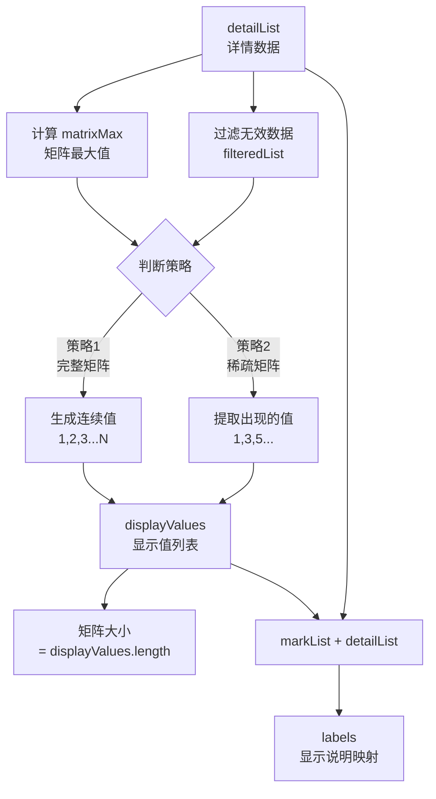
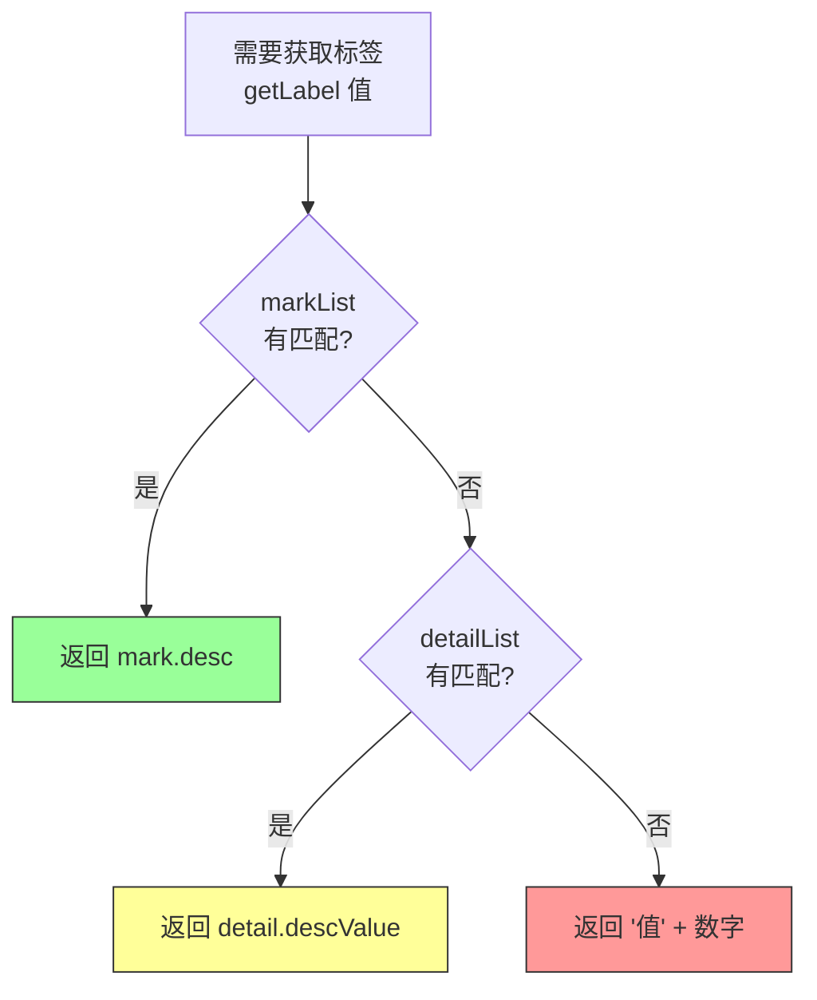
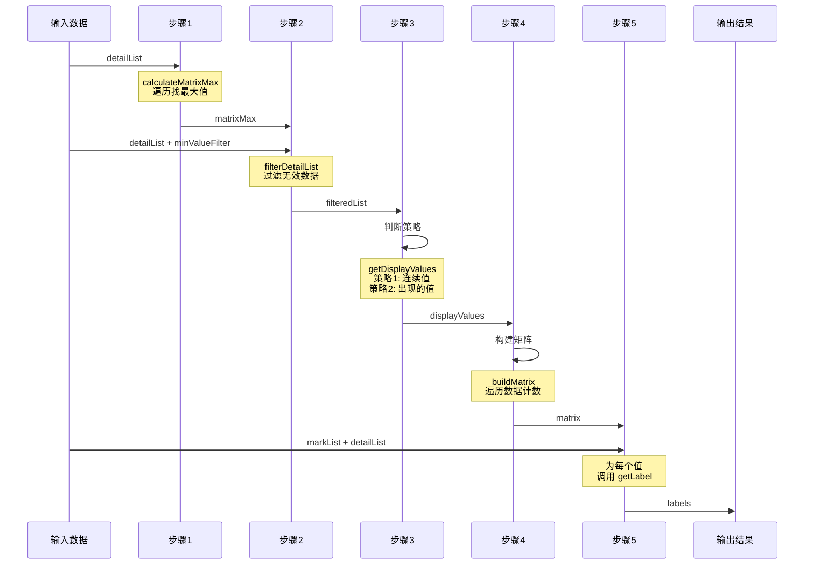

# 混淆矩阵计算详解 - 矩阵大小与显示说明

> 本文档详细说明前端如何计算矩阵大小和显示说明，适合需要理解计算逻辑或移植功能的开发者。

## 目录

1. [概述](#1-概述)
2. [矩阵大小计算](#2-矩阵大小计算)
3. [显示说明（标签）计算](#3-显示说明标签计算)
4. [完整计算流程](#4-完整计算流程)
5. [代码移植指南](#5-代码移植指南)
6. [调试方法](#6-调试方法)

---

## 1. 概述

### 1.1 核心问题

混淆矩阵的渲染需要解决两个核心问题：

1. **矩阵大小**：矩阵是 N×N 的，N 是多少？
2. **显示说明**：每行/列的数值（如 1, 2, 3）对应什么含义？

### 1.2 数据来源

```
后端返回数据:
{
  "detailList": [...]   ← 核心数据，用于计算矩阵大小
  "markList": [...]     ← 可选，用于显示说明
  "statistics": {...}   ← 可选，预计算的统计信息
}
```

### 1.3 计算流程图



---

## 2. 矩阵大小计算

### 2.1 第一步：计算 matrixMax

**目的**：找出数据中最大的分类值

**算法**：

```javascript
function calculateMatrixMax(detailList) {
  let maxVal = 0
  
  detailList.forEach(detail => {
    // 解析实际值
    const actual = parseInt(detail.acturalValue)
    if (!isNaN(actual) && actual > maxVal) {
      maxVal = actual
    }
    
    // 解析预测值
    const predicted = parseInt(detail.predictedValue)
    if (!isNaN(predicted) && predicted > maxVal) {
      maxVal = predicted
    }
  })
  
  return maxVal
}
```

**示例**：

| 序号 | acturalValue | predictedValue | 当前maxVal |
|------|--------------|----------------|------------|
| 1 | "1" | "2" | 2 |
| 2 | "3" | "1" | 3 |
| 3 | "2" | "5" | 5 |
| 4 | "abc" | "3" | 5 (不变，abc无效) |

**结果**：`matrixMax = 5`

### 2.2 第二步：过滤无效数据

**目的**：排除无法参与计算的数据

**过滤条件**：
1. `acturalValue` 必须是有效整数
2. `predictedValue` 必须是有效整数
3. 两个值都必须 `> minValueFilter`（默认0）

**算法**：

```javascript
function filterDetailList(detailList, minValueFilter = 0) {
  return detailList.filter(detail => {
    const actual = parseInt(detail.acturalValue)
    const predicted = parseInt(detail.predictedValue)
    
    // 条件1: 必须是有效数字
    if (isNaN(actual) || isNaN(predicted)) return false
    
    // 条件2: 必须大于最小值
    if (actual <= minValueFilter) return false
    if (predicted <= minValueFilter) return false
    
    return true
  })
}
```

**示例**（minValueFilter = 0）：

| 数据 | actual | predicted | 是否保留 | 原因 |
|------|--------|-----------|----------|------|
| {acturalValue: "1", predictedValue: "2"} | 1 | 2 | ✅ 保留 | - |
| {acturalValue: "abc", predictedValue: "1"} | NaN | 1 | ❌ 过滤 | actual不是数字 |
| {acturalValue: "0", predictedValue: "1"} | 0 | 1 | ❌ 过滤 | actual=0 不大于0 |
| {acturalValue: "-1", predictedValue: "2"} | -1 | 2 | ❌ 过滤 | actual=-1 不大于0 |

### 2.3 第三步：确定显示值列表

**目的**：确定矩阵的行/列标题

#### 策略1：完整矩阵

生成从 `minValueFilter + 1` 到 `matrixMax` 的连续整数。

```javascript
function getDisplayValues_Strategy1(matrixMax, minValueFilter) {
  const startVal = Math.max(1, minValueFilter + 1)
  const values = []
  
  for (let i = startVal; i <= matrixMax; i++) {
    values.push(i)
  }
  
  return values
}
```

**示例**：
- `minValueFilter = 0`, `matrixMax = 5`
- `startVal = 1`
- **结果**: `[1, 2, 3, 4, 5]` → 5×5 矩阵

#### 策略2：稀疏矩阵

只包含数据中实际出现过的值。

```javascript
function getDisplayValues_Strategy2(filteredList, minValueFilter) {
  const valueSet = new Set()
  
  filteredList.forEach(detail => {
    const actual = parseInt(detail.acturalValue)
    const predicted = parseInt(detail.predictedValue)
    
    if (actual > minValueFilter) valueSet.add(actual)
    if (predicted > minValueFilter) valueSet.add(predicted)
  })
  
  return Array.from(valueSet).sort((a, b) => a - b)
}
```

**示例**：
- 数据中出现：`acturalValue = [1, 2, 5]`, `predictedValue = [1, 3, 5]`
- **结果**: `[1, 2, 3, 5]` → 4×4 矩阵（跳过4，因为没出现）

### 2.4 矩阵大小公式

```
矩阵大小 = displayValues.length
```

| 策略 | 公式 | 示例 |
|------|------|------|
| 策略1（完整） | `matrixMax - minValueFilter` | 5 - 0 = 5 |
| 策略2（稀疏） | `出现的唯一值数量` | 4 |

---

## 3. 显示说明（标签）计算

### 3.1 取值优先级



### 3.2 详细算法

```javascript
function getLabel(value, markList, detailList) {
  const strValue = String(value)
  
  // 优先级1: 从 markList 查找
  if (markList && markList.length > 0) {
    const mark = markList.find(m => 
      String(m.value) === strValue || String(m.id) === strValue
    )
    if (mark && mark.desc) {
      return mark.desc  // ← 最高优先级
    }
  }
  
  // 优先级2: 从 detailList 查找
  if (detailList && detailList.length > 0) {
    const detail = detailList.find(d => 
      String(d.acturalValue) === strValue
    )
    if (detail && detail.descValue && detail.descValue !== '无效数据') {
      return detail.descValue  // ← 次高优先级
    }
  }
  
  // 优先级3: 默认值
  return `值${value}`  // ← 最低优先级
}
```

### 3.3 示例

**输入数据**：

```javascript
markList = [
  { id: "1", value: "1", desc: "天气查询" },
  { id: "2", value: "2", desc: "知识问答" }
]

detailList = [
  { acturalValue: "3", descValue: "音乐播放" },
  { acturalValue: "4", descValue: "新闻资讯" }
]
```

**查找结果**：

| 输入值 | 查找过程 | 结果 |
|--------|----------|------|
| 1 | markList 找到 id=1 | "天气查询" ✅ |
| 2 | markList 找到 id=2 | "知识问答" ✅ |
| 3 | markList 未找到 → detailList 找到 acturalValue=3 | "音乐播放" ✅ |
| 4 | markList 未找到 → detailList 找到 acturalValue=4 | "新闻资讯" ✅ |
| 5 | markList 未找到 → detailList 未找到 | "值5" ⚠️ |

---

## 4. 完整计算流程

### 4.1 流程图



### 4.2 代码示例

```javascript
import { computeMatrix } from '@/utils/matrixCalculator'

// 一次性计算所有结果
const result = computeMatrix({
  detailList: [...],      // 后端返回的详情数据
  markList: [...],        // 后端返回的标记列表
  matrixStrategy: '1',    // "1"=完整矩阵, "2"=稀疏矩阵
  minValueFilter: 0,      // 过滤阈值
  debug: true             // 开启调试日志
})

// 使用结果
console.log('矩阵大小:', result.matrixSize)           // 5
console.log('显示值列表:', result.displayValues)     // [1, 2, 3, 4, 5]
console.log('矩阵数据:', result.matrix)              // [[50, 5, ...], ...]
console.log('标签映射:', result.labels)              // {1: "天气查询", ...}
console.log('准确率:', result.accuracy + '%')        // 78.50%
```

---

## 5. 代码移植指南

### 5.1 文件结构

如果要移植到其他项目，只需复制以下文件：

```
src/
├── utils/
│   └── matrixCalculator.js   ← 核心计算模块（纯JS，无依赖）
```

### 5.2 使用方式

#### 方式1：使用便捷函数（推荐）

```javascript
import { computeMatrix } from './utils/matrixCalculator'

const result = computeMatrix({
  detailList: yourData,
  markList: yourMarkList,
  matrixStrategy: '1',
  minValueFilter: 0,
  debug: false
})

// result 包含所有计算结果
```

#### 方式2：单独调用各函数

```javascript
import { 
  calculateMatrixMax,
  filterDetailList,
  getDisplayValues,
  buildMatrix,
  calculateStatistics,
  getLabel
} from './utils/matrixCalculator'

// 步骤1: 计算最大值
const matrixMax = calculateMatrixMax(detailList)

// 步骤2: 过滤数据
const filteredList = filterDetailList(detailList, minValueFilter)

// 步骤3: 获取显示值列表
const displayValues = getDisplayValues(filteredList, matrixMax, '1', minValueFilter)

// 步骤4: 构建矩阵
const { matrix } = buildMatrix(filteredList, displayValues)

// 步骤5: 计算统计指标
const stats = calculateStatistics(matrix, displayValues)

// 步骤6: 获取标签
const label = getLabel(1, markList, detailList)
```

### 5.3 数据格式要求

**detailList 格式**（必须）：

```javascript
[
  {
    acturalValue: "1",      // 字符串格式的整数
    predictedValue: "2",    // 字符串格式的整数
    descValue: "天气查询",  // 可选，用于标签
    // ... 其他字段随意
  }
]
```

**markList 格式**（可选）：

```javascript
[
  {
    id: "1",           // 或 value: "1"
    value: "1",        // 可选
    desc: "天气查询"   // 显示名称
  }
]
```

---

## 6. 调试方法

### 6.1 开启调试日志

```javascript
import { setDebugMode, computeMatrix } from './utils/matrixCalculator'

// 方式1: 全局开启
setDebugMode(true)

// 方式2: 单次计算开启
const result = computeMatrix({
  detailList: [...],
  debug: true  // ← 只对这次计算开启
})
```

### 6.2 控制台输出示例

```
🔢 混淆矩阵计算开始
输入参数: {detailListCount: 200, markListCount: 5, matrixStrategy: "1", minValueFilter: 0}

[MatrixCalc] 开始计算矩阵最大值...
[MatrixCalc] 输入数据条数: 200
[MatrixCalc] 第0条: acturalValue=1 更新最大值为 1
[MatrixCalc] 第0条: predictedValue=2 更新最大值为 2
...
[MatrixCalc] 计算完成，矩阵最大值: 5

[MatrixCalc] 开始过滤数据...
[MatrixCalc] 过滤前数量: 200
[MatrixCalc] 过滤后数量: 190
[MatrixCalc] 被过滤掉的数量: 10

[MatrixCalc] 开始计算显示值列表...
[MatrixCalc] 策略: 完整矩阵
[MatrixCalc] 完整矩阵 - 连续值范围: 1 ~ 5
[MatrixCalc] 最终显示值列表: [1, 2, 3, 4, 5]
[MatrixCalc] 矩阵大小: 5 x 5

计算完成: {matrixSize: 5, totalCount: 190, accuracy: "78.95%"}
```

### 6.3 前端调试面板

组件内置了调试面板，打开方式：

1. 在矩阵右上角找到"调试"开关
2. 点击开启，显示调试面板
3. 点击"打印到控制台"，在 F12 查看详细信息

---

## 附录

### A. 计算公式速查表

| 指标 | 公式 | 说明 |
|------|------|------|
| 矩阵最大值 | `max(所有acturalValue, 所有predictedValue)` | 决定完整矩阵大小 |
| 矩阵大小 | `displayValues.length` | 行数 = 列数 |
| 行合计 | `Σ matrix[i][*]` | 该实际值的总样本数 |
| 列合计 | `Σ matrix[*][j]` | 该预测值的总预测数 |
| 召回率 | `matrix[i][i] / 行合计[i] × 100%` | 该类别的召回能力 |
| 精准率 | `matrix[j][j] / 列合计[j] × 100%` | 该类别的精准能力 |
| 准确率 | `Σ对角线 / 总数 × 100%` | 整体预测准确度 |

### B. 相关文件

| 文件 | 说明 |
|------|------|
| `src/utils/matrixCalculator.js` | 核心计算模块 |
| `src/components/ConfusionMatrix.vue` | 矩阵渲染组件 |
| `docs/BACKEND-GUIDE.md` | 后端数据格式说明 |
| `docs/DATA-CALCULATION.md` | 数据计算逻辑总览 |

---

**文档版本**: 1.0.0  
**更新日期**: 2025-12-06  
**维护者**: AI Assistant

